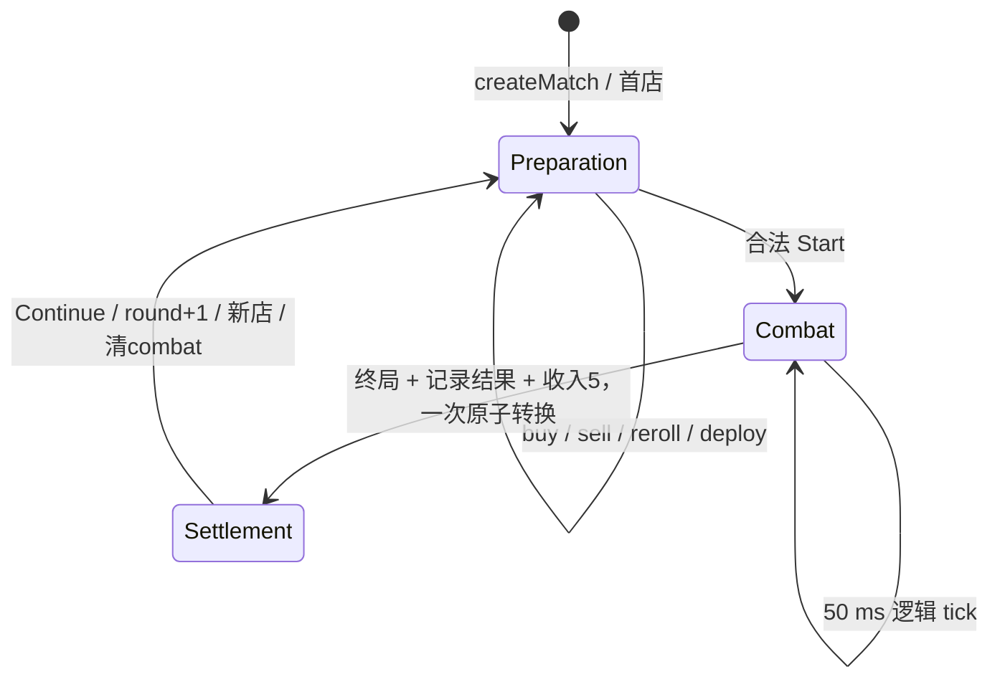
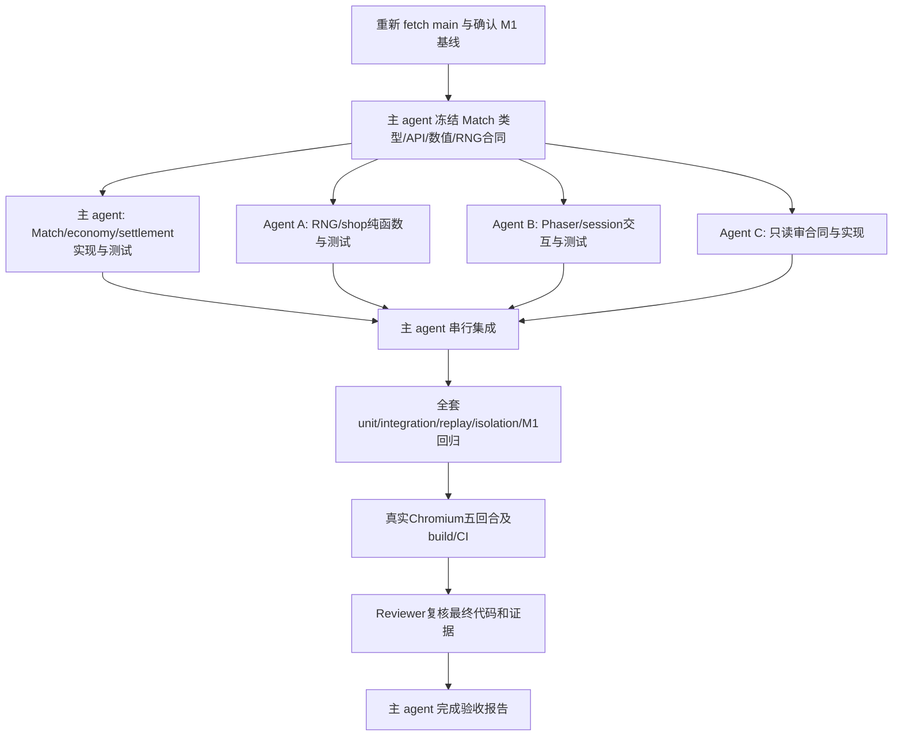

# M2：连续回合最小自动战棋循环计划

## 1. 本轮结论与边界

M2 适合作为当前架构上的完整里程碑。交付目标是同一局内完成“准备 → 商店买卖/刷新 → 布阵 → 战斗 → 结算 → 下一回合”，至少结算 5 个回合并进入第 6 回合准备阶段；不刷新网页，不依赖手动 Reset，不以五次独立战斗代替连续游戏。

需要的结构调整是：把生命周期与经济的权威从 rendering 提升到 simulation 的 MatchState，并让 Phaser 按实例 ID 增删单位视图。复用 M1 的棋盘、部署校验、战斗快照、寻路、普攻、终局和 50 ms tick，不重写战斗核心。

**本文是待实施方案，不是 M2 完成报告。** 本轮只同步/审查仓库、运行已有验证并新增 `M2_PLAN.md`、`M2_GOAL.txt`。不修改产品代码、测试、依赖或工作流，不 commit/push，不创建 feature PR。下面的接口、数值与文件划分是后续实施合同的设计依据，由主 agent 在实施阶段先冻结。

## 2. 已检查的 main 与 M1 真实现状

检查日期：2026-10-04（Asia/Taipei）。仓库：`/workspace/cat`，origin：`https://github.com/catfish-xn/cat.git`。检查前工作区干净；当前本地分支名为 `work`。

执行 `git fetch origin main`，将干净工作分支 fast-forward 到最新 main；`git ls-remote origin refs/heads/main` 再次确认：

`abd9245c01a8bbdd5b26724e6ab156fd2a89dfe3`

已通过 GitHub 元数据核实近期合并 PR，并审查其改动及最终仓库代码：

| PR | 已合并结果 |
| --- | --- |
| [#1 校正战场与阵营部署](https://github.com/catfish-xn/cat/pull/1) | merge `33428d3`；7×8、双方部署区、enemy 权限、hex 邻居/距离及 CI |
| [#2 M1 最小自动战斗](https://github.com/catfish-xn/cat/pull/2) | merge `abd9245`；独立 CombatState、固定 tick、战斗反馈、Reset、开战门禁及验证脚本；最终 PR head `d91f86c` |

本轮审查涵盖 README、历史 `M1_PLAN.md`、`docs/COMBAT_CONTRACT.md`、`docs/M1_VALIDATION.md`、全部 simulation 文件、Phaser scene/session/layout、七个测试文件、浏览器脚本及 CI。未发现适用的仓库 `AGENTS.md`。历史 M1 计划里的旧基线阻塞已由 PR #1/#2 解除，不是当前 M2 阻塞。

| 层/文件 | 当前实际行为 | 对 M2 的意义 |
| --- | --- | --- |
| `src/simulation/board.ts` | 7×8；player row 4–7，enemy row 0–3；固定邻居顺序及 hex distance | 保留，不新增等级/部署数量限制 |
| `src/simulation/units.ts` | sentinel/ranger/mystic 三个占位定义；实例含 ID、阵营、位置 | 可直接用作商店目录；实例无战斗 HP |
| `src/simulation/game.ts` | GameState = board/benchSize/units；7 格 bench，初始 5 个 player bench 单位、2 个敌方 board 单位 | preparation 继续使用此类型；部署失败返回原 state |
| `combat.ts` / `combat-types.ts` / `combat-tick.ts` | board-only 隔离快照；50 ms/tick，最多 1200 tick；自动寻敌/BFS/移动/普攻/同时伤害/死亡/胜负 | 战斗只操作 CombatState；bench 不参战；终态 step 无新事件 |
| `src/rendering/combat-session.ts` | 自己持有 preparation、Start snapshot、combat、phase、accumulator，并负责 Start/Reset | M2 必须迁移规则职责；只留下命令转发与时间累积 |
| `src/rendering/BoardScene.ts` | create 时一次性建 tokens；sync 假设单位始终存在；显示血条、伤害、结果 | 买卖必须增加视图增删，不能只追加按钮 |
| `src/main.ts` / layout | 960×800 FIT 画布，bench y=660、提示 y=748 | 商店需要重新安排 UI 空间，验证缩放命中 |

本轮基线验证：

- Node `v24.19.0` / npm `11.9.0`。默认 npm cache 路径不可写导致首次安装失败；改用 `/tmp/cat-m2-npm-cache` 后 `npm ci` 成功，未改依赖或锁文件。
- `npm test`：**7 个测试文件、59/59 通过**。分布为 board/deployment/layout 23、combat contract 4、combat simulation 17、combat session 8、combat start 7。
- `npm run build`：typecheck 与 Vite build 通过。已有 Phaser chunk >500 kB 提示，不属于本里程碑的打包优化任务。
- 实际重新执行现有 `scripts/verify-m1-browser.cjs`；最终结果见本文件末尾的本轮验证记录。
- 已核查 [PR #2 最终 head 的 CI run 37204086154](https://github.com/catfish-xn/cat/actions/runs/37204086154)：`npm ci`、`npm test`、`npm run build` 全部 success；该 head 与 main merge 的文件树无差异。main 的 combined-status 接口返回空列表，不能将它当作 main merge 自身的 CI 通过证明。
- 当前 CI **不运行 Chromium**。M1 浏览器脚本依赖外部 Playwright 和系统 Chromium，验证两次 Start → result → Reset。五回合经济流程和 browser CI 都是 M2 待补内容。
- M1 验证文档前部的 49 tests 是历史中间版本，末尾 59 tests 才对应当前代码。

## 3. 玩家可体验范围与明确规则

### 3.1 本里程碑数值

采用简单固定规则，让实现与验收无需猜测。数值集中在 simulation 的 M2 rules 中，UI 只读取。

| 项目 | M2 决定 |
| --- | --- |
| 起始 round / gold | 1 / 10 |
| 初始阵容 | 保留 M1 的 5 个 player bench 单位；7 格 bench 不变 |
| 单位购买价 | 三种占位单位均为 3 gold |
| 出售价 | player 单位均为 2 gold，包括初始单位；无星级因素 |
| reroll 费用 | 2 gold |
| 每回合基础收入 | 战斗结算时 +5；胜、负、平都相同 |
| 额外收入 | 无首轮额外发钱、胜负奖金、利息、连胜/连败奖励 |
| 商店 | 固定 5 槽，可重复抽中同一单位，独立有放回抽样 |
| 敌阵 | 每轮沿用 M1 两个敌方定义及初始站位；不成长、不随机、不消耗商店 RNG |
| 回合上限 | 不硬编码 5 回合终止；5 回合是最低验收长度 |

正常流程：结果页显示“第 N 回合结果 / 本轮收入 +5 / 当前金币”，随后点击 Continue。金币已在结果产生时入账；Continue 不再发钱。战败或平局也能继续。

购买必须进入 bench，不能在 bench 满时自动放上棋盘。五个初始单位使开局有两个空 bench 槽，也可先部署再购买。所有已购与初始 player 实例、当前 board/bench 位置跨回合保留；卖掉的单位不会在下一轮重新出现。

### 3.2 排除项

不实现 XP、player level、等级商店概率、shared champion pool、3 合 1、2/3 星、traits、items、champion abilities、mana、augments、anomalies、player HP/elimination、8-player multiplayer、PvP networking、S13 正式英雄数据、Riot assets、React、3D。

这些系统都不是 M2 技术前置。也不增加存档 UI、通用 replay 播放器、通用事务系统、ECS、事件总线、复杂难度曲线或高级美术。JSON 序列化测试只证明状态完整，不意味着要实现存档产品功能。

## 4. 状态边界与唯一权威

### 4.1 MatchState

主 agent 负责 `src/simulation/match-types.ts` 与 `match.ts` 的公共合同。采用 readonly 数据和 phase 判别联合，避免无效组合。

长期共同字段：

- `seed`：本局初始 uint32 seed；默认演示 seed 为 42。
- `rngState`：当前 RNG uint32 状态；不藏在闭包、模块全局或 controller。
- `round`：当前回合，从 1 开始。
- `gold`：非负安全整数。
- `shop`：`generation` 与恰好 5 个固定位置的 slots。
- `nextUnitSerial`：从 6 开始，成功购买才递增，生成 `unit-6`、`unit-7`……；不会与初始 `unit-1..5` 或 `enemy-*` 冲突。
- `preparation: GameState`：当前拥有阵容和准备站位的唯一权威。
- `roundResults`：按 round 顺序追加的只读结算摘要，至少含 round、result、combatTicks、income、goldBefore、goldAfter；不保存整场每 tick 日志。

phase 约束：

| phase | combat | 结算记录 |
| --- | --- | --- |
| preparation | null | 已完成 1..round-1 |
| combat | running CombatState | 已完成 1..round-1 |
| settlement | finished CombatState，result 非 null | 已完成 1..round；最后一条对应当前 round |

`shop` 是准备阶段可操作的数据，不额外设 shop phase。`result` 是 settlement 的结果内容，不另设一套可相互矛盾的 phase/boolean。`next round` 是受校验的命令，不是由 UI 临时推导的 round 数字。

### 4.2 Preparation GameState

保持现有 `GameState` / `Unit` 模型，不加入 HP、alive、cooldown、targetId、gold 或 RNG。Match 命令包装并复用 `deployUnit`、`validateDeployment`、`validateCombatStart`。原低层 API 保留供测试/战斗使用，但正常 UI 不能绕过 Match 门禁调用部署提交。

### 4.3 临时 CombatState

继续通过 `createCombat(preparation)` 创建隔离的 board-only 快照；不能引用可变准备 cell/board 对象。战斗 step 不读写金币、商店或阵容。

Match 在终局之外的 tick 保持 preparation/gold/shop/RNG/实例序号/历史不变；终局只按明确结算规则修改金币与结果记录。下一回合丢弃 combat，保留准备阵容，再从准备状态创建新战斗；禁止把战斗结束时的单位位置、HP、死亡信息复制回 preparation。

### 4.4 Rendering session

将现有 session 调整为薄的 MatchSession（文件可在主 agent 协调下重命名）：只持有当前 MatchState 引用、50 ms accumulator，并转发 simulation commands。不能自己生成商店、扣款、加钱、递增 round 或决定胜负。

Phaser delta 只决定调用几次 `stepMatch`；不得传入 simulation 作为真实时间规则。非法/负 delta 忽略，保留未满 tick 余量；终局与 Continue 清零余量。若设置每帧处理上限，必须保留 backlog。动画/tween 完成、重绘和战斗事件都不是经济输入。

## 5. 公共 Match API 与失败原子性

以下语义在实施波次 1 由主 agent 冻结为实际类型；不允许子代理各自发明 API。针对已有 MatchState 的玩家命令返回统一 `{ ok, state, reason? }` 判别结果；需要事件的推进返回 `{ state, events }`。初始化单独约定为 `createMatch(seed = 42): MatchState`：非法 seed 抛出 `RangeError`，不返回部分状态；默认值只用于省略 seed，不能用于替换非法输入。

| API | 权限与成功效果 | 失败/无效调用 |
| --- | --- | --- |
| `createMatch(seed)` | 校验 seed，创建 round 1 / gold 10 / M1 阵容，免费生成首个五槽商店 | 初始化拒绝非 uint32 整数；不读时间、不随机补 seed |
| `deployMatchUnit(state, unitId, target)` | 仅 preparation；复用现有部署校验，更新 preparation | 非准备阶段、敌方、非法位置、占用等返回原 state |
| `buyUnit(state, slotIndex, expectedGeneration)` | 仅 preparation；合法且可售槽、金币≥3、bench 有空位；扣3、分配实例、放最小空 slot、标记 purchased | 无效 index、过期商店、已购买槽、金币不足、bench满、阶段不符都原子失败 |
| `sellUnit(state, unitId)` | 仅 preparation；player 且存在；board/bench 都允许；删该实例、加2 | enemy、未知/重复出售、非准备阶段失败 |
| `rerollShop(state)` | 仅 preparation 且金币≥2；扣2、生成五槽、generation+1 | 不足或非准备阶段原子失败 |
| `startMatchCombat(state)` | 仅 preparation；双方各至少一个 board 单位；createCombat；不动经济/RNG | 沿用 missing-player/enemy/both；重复 Start 无效果 |
| `stepMatch(state)` | combat 时推进恰好一 tick；若终局，同一转换内自动结算并进入 settlement | 非 combat 原 state、空事件；没有额外经济变化 |
| `nextRound(state, expectedRound)` | 仅 settlement 且 round 匹配、结算记录有效；round+1、combat=null、免费新商店、保留阵容、进入 preparation | 提前、重复或旧回合 Continue 不跳轮、不耗 RNG、不发钱 |

UI 不传 cost、income、战斗 result 或目标金币。所有金额由 simulation 的规则决定。shop 槽用判别状态，例如 `available(definitionId)` / `purchased`；购买后保持位置，不能压缩数组或自动补卡。

统一失败合同：

1. 输入不可变；失败 `result.state === inputState`，全量深等值。
2. gold、rngState、shop/generation、nextUnitSerial、preparation、combat、roundResults 全部不变。
3. 所有校验完成后才创建新实例、抽 RNG、扣费和发布新 state；不采用“先扣钱再回滚”。
4. bench 按 slot 数字从 0 到 benchSize-1 找第一个空位，不依赖 units 数组顺序；出售后不重用 instance ID。
5. 阶段优先拒绝；再校验输入/对象和业务条件。精确 failure 枚举在合同冻结时确定，同一输入的失败原因稳定。
6. 模块不依赖 Phaser、DOM、Date、performance、crypto.randomUUID 或 Math.random；UI 灰按钮仅是反馈，不替代 simulation 校验。

`expectedGeneration` 防止旧商店点击买到新一代槽位；`expectedRound` 防止旧结果页动作在另一回合生效。不为本地同步 UI 增加网络幂等键或通用命令队列。

## 6. RNG 与可重放规则

采用明确的 `lcg32-v1`：每次抽样计算 `next = (Math.imul(state, 1664525) + 1013904223) >>> 0`，返回该 uint32 和新状态。接受 0..4294967295 的整数 seed，seed=0 合法；不接受 NaN、Infinity、负数、小数或超范围数。初始化非法参数明确拒绝，不静默更换 seed。

商店目录固定为 `[sentinel, ranger, mystic]`；每槽用一个新 word，索引为 `floor(word / 4294967296 * 3)`，按 slot 0→4 生成。因此每次完整 shop 恰好消耗 5 个 word，不使用可变次数的抽样或拒绝抽样。此为占位目录的固定映射，不是未来等级概率系统；不承诺密码学随机或统计上严格无偏。

已计算的参考向量（实施测试必须使用独立固定期望值，不能调用被测函数生成期望）：

| seed | 前五个 word | 对应目录索引 |
| --- | --- | --- |
| 0 | 1013904223, 1196435762, 3519870697, 2868466484, 1649599747 | 0, 0, 2, 2, 1 |
| 42 | 1083814273, 378494188, 2479403867, 955863294, 1613448261 | 0, 0, 1, 0, 1 |

只有以下操作推进 RNG：createMatch 的首个商店、成功 reroll、成功 nextRound 的新商店。buy、sell、deploy、Start、combat tick、settlement 和所有失败命令均不推进 RNG。

`shop.generation` 从 1 开始，每次成功完整刷新 +1；购买不改变 generation。刷新可以恰巧得到相同五张，允许一个商店出现重复定义；不得用“内容一定不同”作为刷新验收，也不得断言任意不同 seed 的单次五槽必然不同。

在相同规则版本下，相同 seed、initial MatchState 和有序命令/tick 序列，必须得到逐步相同的状态、错误、shop、RNG、实例 ID、战斗事件、gold 和 roundResults。中途 JSON roundtrip 后继续也必须一致。重放日志由测试持有，M2 不开发 replay UI 或持久化协议。

## 7. 回合生命周期与结算防重

1. Start 读取当前完整 preparation；不回到初始免费五个单位，不丢失买卖或站位调整。
2. `stepMatch` 调用既有 `stepCombat`；根据返回的 `status/result` 结算，不能只监听 `combatFinished` 事件。保留 createCombat 的底层 tick-0 终态语义；若内部创建路径产生终态，也走同一结算路径，不等待不存在的下一事件。
3. 结算读取当前 CombatState 的结果，原子地追加当前 round 的唯一记录、gold+5、phase=settlement。检查该 round 尚无记录；没有 UI 可调用的“领取奖励”命令。
4. settlement 保留终态战斗用于展示，不允许 buy/sell/reroll/deploy/Start。重复 tick 返回原状态和空事件；重放事件、持续 render/update、停留结果页不能再次发钱。
5. Continue 校验 phase、expectedRound、唯一记录，然后保留 player 阵容/准备站位、保留或复制未被战斗修改的固定 enemy 准备模板，round+1，生成下一店，丢弃 combat。**Continue 收入为 0。**
6. 连点 Continue 的第二次因已是 preparation 失败，不会跳两轮或再消耗 5 次 RNG。上一回合的 expectedRound 在后续 settlement 也必须被拒绝。
7. 新战斗由准备数据重新构造：tick=0，hp=maxHp，alive=true，targetId=null，攻击/移动 cooldown=0。先前阵亡的自有单位仍在准备阵容中；卖掉的实例始终不存在。

正常 UI 用 Continue 取代 M1 的单场 Reset。若保留原 Reset 按钮位置，改为明确的 **Debug New Match**：调用 simulation 的 createMatch 以同 seed 重开整局，金币/round/shop/RNG/阵容/历史全部重置，不能“保留奖励再重打同一回合”。该按钮不参与正常五回合路径，不实现经济回滚式单场重试。

M1 的单场 Reset 生命周期被上述流程有意替换；其恢复准备站位、清战斗状态、再次开战的保证迁入 Continue 测试。所有其他 M1 行为保持回归覆盖，不得通过删除旧隔离断言获得通过。

## 8. Phaser UI 与交互

- 持续显示 Round、Gold、当前阶段；准备时显示五张商店卡、名称/符号/价格、Buy、purchased 状态、Reroll 与费用。
- 复用拖拽部署。Sell 采用“选中 player 单位 → 显示名称和出售价格 → 点击 Sell”，支持 board 与 bench；敌方不可选为出售目标。拖拽与选中明确区分，切阶段/卖掉选中实例后清空选中与拖拽。
- Start Combat 在缺少双方部署或阶段不符时不可执行，并保留具体失败提示。buy/sell/reroll 同样给出金币不足、bench 满等原因。
- settlement 显示 Victory/Defeat/Draw、本轮号、本轮收入和 Continue；经济控件在 combat/settlement 不可操作。
- 建议保持现有 960×800 逻辑画布，优先评估棋盘底部与 bench 之间的一行五槽商店，顶部显示 Round/Gold，右栏放操作及结果。当前棋盘下缘约 y=560、bench 上缘 y=622，只有约62px净空；完整卡片及按钮bounds必须容纳于净空内，不能只验证一个中心坐标。若名称/价格/按钮的可点击面积不足，可调整逻辑尺寸与布局；必须由浏览器截图与缩放命中验证决定，不能遮挡棋盘、bench或挤出视口。
- 新增按实例 ID 的视图同步：缺少的 ID 创建 token/label/hp/disc/input；删除的 ID 销毁 token、tween、Map 项与悬空选择；已有的 ID 更新显示。不能继续假设初始 tokens 集合永不变化。
- Continue/Debug New Match 清理 effects、tweens、renderedCells、draggingId、pointer drag、overlay；准备视图恢复 visible/alpha/input，隐藏并清空 HP bars；session 清 accumulator。
- 渲染器只展示 commands 返回的状态/错误。不得复制价格判定、从动画发金币或用 token 是否可见判断单位是否存在。
- 给按钮/槽/单位添加稳定 name/data，用只读 bounds 定位真实点击。需要浏览器观察接口时只提供复制的可序列化快照和布局信息，不暴露状态 setter。

## 9. 依赖图、实施波次与 subagent 所有权

**总并发最多 4，含主 agent；即主 agent + 最多 3 个 subagents。** 公共 Match API、类型、数值合同和最终 integration 始终属于主 agent。

图中的实现/CI/交付波次仅在后续获准实施 M2 时开展；本轮停在本文和短 Goal 文件。

| 角色 | 独占文件/职责 | 依赖与限制 |
| --- | --- | --- |
| 主 agent | `simulation/match-types.ts`、`match.ts`、M2 rules；Match/economy/settlement/replay/integration 测试；契约文档；package/lock/CI、浏览器脚本与最终证据 | 冻结 API 后再并行；必要的 units/game/combat 公共调整仅主 agent 做；不得大改 combat-tick |
| A：Shop / RNG | `simulation/rng.ts`、`shop.ts`；`tests/rng.test.ts`、`shop.test.ts` | 只实现合同规定的 RNG/五槽纯函数；不独立写 gold、match phase 或 match.ts |
| B：Rendering / interaction | `BoardScene.ts`、薄 session、layout/main/style（仅必要布局）；session/UI 测试 | 通过冻结 API 开发；不编辑 simulation 公共文件、经济规则、CI 或 A 的文件 |
| C：Independent reviewer | 只读审合同、diff、测试与 browser JSON/截图/CI，提出问题并复核修复 | 不承担主要功能实现，不与 A/B 抢文件；不自行修改核心文件 |

波次 0：后续实施开始前重新 fetch 并记录 SHA；检查与本文基线差异，运行基线。本文不假设 main 永远停在 abd9245。

波次 1：主 agent 先落公共类型、函数签名、失败原因、规则、shop/RNG 子接口及最小契约测试；reviewer 审核相互约束。合同能 typecheck 且依赖方向清楚后，冻结共同基线。临时桩必须有明确清单，不能带入最终验收。

波次 2：A/B 在共同基线的独立 worktree/分支内并行，主 agent 实现 Match/economy/lifecycle。可以用测试 double 验证模块边界，但最终必须全部替换为真实实现。A 的 RNG/shop 是运行端到端 match 的实际前置，不把纸面并行当集成已完成。

波次 3：主 agent 审查实际 diff 后串行集成 A 和 B；只读 reviewer 针对集成版本复审。遇到 API 变更，主 agent 先修改合同并通知相关 agent，暂停受影响工作后统一更新；禁止两人同时拥有 match.ts 或 BoardScene.ts。

波次 4：主 agent 完成全套验证、修复、browser/CI；reviewer 复核最终证据。有任何玩家流程缺口就继续修复，不以 simulation 单独完成或按钮占位声明 M2 完成。

## 10. 详细 acceptance criteria

### 10.1 纯逻辑与失败原子性

下表每一行都必须有明确自动化断言；失败统一断言同一 state 引用、完整深等值和 frozen input 未被修改。

| ID | 必须通过的条件 |
| --- | --- |
| S01 | createMatch(42) 得到 round1/gold10、五个可售槽、generation1、规定 RNG 状态、5 player/2 enemy、benchSize7、空结果历史且无 combat |
| S02 | seed 0/最大 uint32 的有效边界和非法 seed 拒绝；已知 RNG 向量与目录顺序固定 |
| S03 | buy 扣3，新增唯一 player 实例，落到最小空 bench slot，只把一个商店槽变 purchased；成功也不推进 RNG |
| S04 | 无效/小数/越界 shop index、过期 generation、已购买槽、gold<3、bench满，全部拒绝；特别用 gold≥3 的满 bench 单独检验 |
| S05 | 购买失败不分配 ID、不改槽、不改 RNG；恰好 gold=3 可买到 gold0；bench 恰好一个空位可用；units 数组重排不改变目标空位 |
| S06 | board 与 bench player 都能 sell，增加2，恰好删除该实例；enemy/不存在/重复出售失败；卖后新 ID 不复用 |
| S07 | reroll 恰好扣2、generation+1、消耗5个 RNG word、恢复五个可售槽；gold=2 成功，gold<2 原状态/RNG；允许内容偶然相同 |
| S08 | combat 与 settlement 中直接调用 buy/sell/reroll/deploy/Start 全部拒绝，不靠 UI 防护；repeat Start 不重新建快照或归零 tick |
| S09 | 沿用 missing-player/enemy/both 门禁，bench不计；最后一名 board player 回 bench/出售后不允许 Start；重新部署后恢复可开战 |
| S10 | win/loss/draw/timeout 都只追加一条本轮结果且加5；记录 goldBefore/goldAfter/income 正确；非终局 tick 不变经济/RNG |
| S11 | settlement 后重复 step、重复渲染事件、停留多帧都不增加金币/记录；没有接受 UI reward/result 的公共接口 |
| S12 | Continue 仅在当前已结算 round 成功；round精确+1，收入0，五槽新店，RNG恰好推进5次；提前/重复/过期 Continue 完全不变 |
| S13 | 购买保留、出售不复活、所有 player ID/definition/board/bench 位置保留；combat=null；后续 Start 满HP、alive、target=null、冷却0、tick0 |
| S14 | preparation、MatchState 历史快照及嵌套对象在完整战斗后仍未被修改；战斗对象与准备对象不共享可变嵌套数据 |
| S15 | 50 ms whole ticks；非法 delta 无影响；总时长相同、分割方式不同的帧序列产生相同事件/结果/经济；终局后不把剩余 delta 推进到下一回合 |
| S16 | Debug New Match 若保留，重置整个 match；不能保留已发收入重试同 round；不计入连续五回合成功路径 |

### 10.2 Integration、replay 与 M1 回归

- 在同一个 MatchState 演进链运行 buy、bench/board sell、reroll、deploy、Start、真实 stepCombat、settlement、Continue；完成 round1–5 并进入 round6 preparation。所有边界通过公共 Match API，不能直接改 gold/phase/result 或把五个 createCombat 拼起来。
- 用独立金额账本核对：`gold = 10 - 3×成功购买次数 + 2×成功出售次数 - 2×成功reroll次数 + 5×已结算回合数`。仅统计成功操作，Continue 不增加收入。
- 相同 seed/初态/命令日志跑两次，比较每个命令的结果和全量 MatchState、每店序列、ID、roundResults 及战斗事件；不是只比较最终胜负。
- 在有效日志中插入失败 buy（含满bench）、失败 reroll、非法 sell、combat/settlement 中经济操作，去除拒绝记录后有效状态轨迹与原日志一致。
- 从中间 preparation、combat、settlement 状态分别 JSON 序列化/反序列化后续跑，输出与不中断一致；证明没有隐式 RNG/结算状态。
- 用真实战斗分别覆盖 playerWin/enemyWin/draw 的结算与 Continue；低层终态/timeout 等 M1 fixture 可复用。成功循环不要求五轮全胜。
- 保留 M1 棋盘边界、邻居顺序、距离、部署权限/占用/非法位置、bench排除、Start资格、确定性寻敌/BFS/移动争抢、射程/间隔、同时伤害/死亡、timeout、终态no-op、array-permutation 和输入不变性覆盖。
- 现有 session 的测试入口可迁移到 MatchSession；原 Reset 的准备恢复/第二场新鲜状态/clock和effects清理断言迁入 Continue，记录有意更改的 phase/result/Reset语义；不删断言掩盖回归。
- 建议新增 match-contract、match-economy、match-lifecycle、match-replay、match-isolation 测试文件；文件数量可按可读性合并，覆盖不可省略。

### 10.3 真实 Chromium 五回合

使用真实 Playwright 点击/拖拽驱动 Phaser，默认 seed=42，同一页面和同一 match，完成以下步骤：

1. 开局截图与只读快照：Round1、Gold10、五槽、初始五个 bench player、两个敌方；未部署时 Start 被拒绝。
2. 连买两个不同槽：10→7→4，bench5→6→7；实例可见、可拖拽、槽为 purchased。再次点击 purchased 槽不变化；满bench时尝试第三个未购槽失败，即使有4金币也不能扣款。
3. 从 bench 卖掉一个刚买实例：4→6；实例和视图消失。reroll：6→4，新 generation、五个可售槽，旧 purchased 清除。保留另一个已购实例以验证跨轮。
4. 将保留的购买实例真实拖到我方空棋盘格；再部署其他单位。另把一个初始 player 部署到 board 后出售：4→6，board实例/视图消失且后续不复活。这样同时验证 board 与 bench 出售。
5. Start；测试重复 Start、部署及经济按钮受限；在进入终局之前核对经济/RNG/准备阵容不变。观察实际移动、攻击、掉血、死亡与结果显示。
6. round1 终局只入账5：6→11。结果页停留多个 frames，核对仍为11且一条记录；Continue 连点两次只能进入 round2，仍为11；新五槽出现。
7. round2 保留购买实例的 ID、定义与准备位置，售出实例不出现；真实调整该购买实例站位，再战。之后继续完成 round3、4、5 的战斗和结算，每轮可正常调整阵容。
8. 再 Continue 到 round6 preparation。若除上述操作外不额外买卖/刷新，五次结算后的金币应为31，结果历史恰好round1..5；商店 generation=7（首店+一次reroll+五次Continue）。逐轮账本作为独立证据，不以末值替代逐轮校验。
9. 每轮第一次观察 combat 可能已超过 tick0：用该轮 preparation 在独立纯逻辑中 createCombat 后推进到观测 tick，再与 live combat 全量比对；不注入 live state，不强制结束或加速仿真来伪装真实流程。
10. 每次 Continue 后，combat=null，准备token可见、alpha正常、HP bars隐藏、tweens/effects/旧拖拽清空。下一次 Start 无上一场HP/death/target/cooldown残留。
11. 全程不 reload、不 Reset、不跳过真实购买或结算；pageerror 和意外 console.error 为零。额外检查桌面缩放及390×844触摸模拟的关键点击/部署，不把模拟称为物理触屏验证。

输出 JSON 操作账本、seed、代码 SHA、浏览器版本、各轮结果/tick/金币前后/商店generation与RNG/保留实例ID，以及首店、购买、出售、结果、下一轮的截图。失败也保存日志、最后快照和截图。

M1 的缺敌方 browser fixture 可以保留为单独负向测试；不能在上述五回合主流程中改写模块、重载页面、调用内部命令替代鼠标，或写入 live state。

### 10.4 Build 与 GitHub CI

- 后续实现需通过 `npm ci`、`npm test`、`npm run build`；build 继续包含 TypeScript 检查。
- 保留现有 Node22 unit/build job。只为可重复 browser 验证新增锁定版本的 Playwright dev dependency、`test:browser` npm script 与 Chromium CI job，不升级无关依赖。
- browser job 安装匹配 Chromium，启动 Vite/等待ready，执行真实五回合脚本并上传 JSON/截图/失败trace。当前 harness 依赖 dev 模块，不虚称已覆盖生产 bundle；另做 build preview 启动与首屏 smoke，或将新只读观察接口设计为兼容 preview。
- 按单场最多60逻辑秒，为五回合设置充分超时（建议 job 10–15分钟、单战斗等待≥75秒），禁止为了通过而改变50ms tick或跳过失败检查。
- M2 完成证据必须对应**最终实现 commit SHA** 的 GitHub CI 成功，以及同版本的 browser记录。旧 M1 CI 或旧分支绿灯不能替代。
- 未解决 blocker、未执行五回合 browser、测试失败或最终 CI 未通过，都不能宣称 M2 完成。网络/环境失败应报告真实限制，不能记为通过。

## 11. 风险、返工点与控制措施

| 风险 | 后果 | 预防/验收 |
| --- | --- | --- |
| session 与 Match 同时拥有规则状态 | 旧 snapshot 恢复掉已买阵容或复制收入 | Match 单一权威；session 仅转发；先冻结迁移合同 |
| 结算依赖事件/动画/UI | 漏发或重复奖励 | 终局 tick 原子结算；没有 claim reward；多帧和重复调用测试 |
| 失败前先抽样/分ID | 钱没变但重放分叉 | 全量 state identity/deep equality；成功后才分配 |
| 初始 token 集合固定 | 新买棋不可见或 sync 崩溃，卖棋残留 | 按 ID 增删视图；真实买/卖/死亡后Continue测试 |
| ID 使用数组长度或复用 | 与现有ID冲突，改变确定性寻敌顺序 | Match 单调序号；保持 M1 code-point 排序，不改为数字排序 |
| 连点与旧回调 | 重复Continue、旧店误购、迟到dragend | phase校验、expectedRound/generation、切阶段清输入；不从动画发命令 |
| UI 垂直空间与点击缩放 | 商店挡棋盘/bench，Canvas点错 | 稳定对象名与bounds；截图检查、缩放/触摸模拟回归 |
| 刷新内容偶合 | 测试误报，错误强制重抽破坏RNG | 验generation/RNG固定步数，允许同内容 |
| 误保留单场Reset | 结算金币可刷、round不推进 | 正常Continue；debug只整局重开；五轮验收禁Reset |
| 玩家卖光且将钱耗于reroll | 没有player可Start且买不起，形成自毁软锁 | 不声称任意合法操作序列都可继续；初始阵容与每轮收入保证正常五轮路线；若保留Debug New Match，可用于恢复，不暗加救济、XP或消极淘汰系统 |
| 固定敌阵和无升级 | 内容深度有限、后期简单 | 属于M2明确范围；保证真实经济/阵容循环，不扩展难度或英雄系统 |
| 仅在dev浏览器检查 | build通过但生产首屏问题漏检 | build及preview smoke；不把私有Phaser/Vite结构当稳定外部API |
| 历史文档互相矛盾 | 后续误按rendering拥有生命周期实现 | 更新当前README/Combat Contract，新增M2合同与证据；保留M1计划为历史，不改写历史结论 |

五回合目标保证一条完整、可重复、正常可玩的循环，不保证玩家在卖光且耗尽金币后仍无需重新开局。该极端操作不作为缩减买卖功能的理由；本里程碑不增加隐式救济规则。

最可能返工的接口是 Match/session 边界、settlement入账时点、shop generation/实例ID、动态token清理和浏览器观察方式。它们必须在并行实现前确定；数值平衡和高级视觉不应抢占这些工作的时间。

## 12. 完成门槛与本轮停止点

后续 M2 完成必须同时满足：完整玩家五回合循环、表中规则与失败原子性、确定性重放、状态隔离、M1回归、真实Chromium证据、build和最终GitHub CI，以及独立review无未解决阻塞。不能以某个子代理完成单模块代替整个里程碑完成。

本轮只保存这份计划及 `M2_GOAL.txt`；不启动上述实现波次，不改产品、不创建 feature PR。

### 本轮 M1 浏览器复核记录

已在上述 main SHA 实际重跑原有 `scripts/verify-m1-browser.cjs`，Chromium `151.0.7922.173`。两场真实鼠标部署/Start/结果/Reset 流程通过，结果分别为 playerWin、tick121 和 tick141；移动、攻击、HP下降、死亡、准备状态恢复与再次开战检查通过，`errors=[]`。缺player、最后一名player回bench，以及独立启动fixture中的缺enemy/缺双方检查均通过。

本轮证据位于 `/tmp/cat-m2-baseline-browser/results.json` 及同目录截图。它确认 M1 当前可运行，不代表 M2 五回合已验证；结果文件中的两条 round 是脚本对两场 Reset 战斗的编号，产品当前还没有 Match round。M1 脚本只捕获 pageerror，M2 会另加意外 console.error 采集。

## 13. 桌面端高频操作手感：正式验收补充

本节属于既有 shop / economy / interaction 的质量门槛，追加到当前 M2 Goal。沿用现有架构、功能范围、五回合循环与分工，不重新规划里程碑。实现、独立 reviewer 和最终 Chromium 验收均必须覆盖以下条件。

- `D` 是 reroll 快捷键。每个合法 keydown（包括操作系统自动重复）按事件顺序提交一次 simulation command，立即扣费并刷新五槽商店。不得遗漏合法事件、重复扣费或重复推进 RNG；不对合法输入人为 debounce。
- `E` 出售当前悬停单位；无悬停单位时使用明确选中的我方单位。悬停 enemy 时拒绝，不能退回出售此前选中的 player。board / bench 均支持；成功后立即删除实例、增加金币并清除失效选择/拖拽。继续按 E 不得再次出售同一实例。
- D/E 不处理 Ctrl/Meta/Alt 组合、输入法组合输入或文本编辑控件内输入；场景退出时释放监听，避免重复绑定。`F` 无功能，不引入 XP。
- 购买成功立即进入第一个合法空备战格。拖拽释放、购买、出售和 reroll 同步提交 simulation 状态，HUD/shop/token 随即与该状态一致；不得等待动画结束，rendering 动画不得锁住下一次合法输入。
- 高频 D 与点击/拖拽/E 混合输入共用当前 MatchSession 和纯命令校验。不得在 UI 修改 gold、shop、RNG、阵容，不保留跨事件的过期 MatchState。
- 金币不足、bench 满、已购买槽位、无出售目标等失败无部分提交：不扣金币、不推进 RNG、不分配实例 ID，不改变阵容。combat / settlement 禁止 buy、sell、reroll、deployment；战斗时钟可以正常推进，但经济与准备状态保持锁定。

### 必须保留的验证证据

1. 自动测试无动画/时钟推进的连续命令、完整状态重放、成功计价与 RNG 次数、失败原子性、重复出售及 combat 锁定；原 M1/M2 测试、build、CI 全部通过。
2. 真实 Chromium 使用真实键盘、鼠标点击和拖拽，至少连续三次执行 `D → buy → deploy → E sell → D → buy`，不在操作间添加人为动画等待。每一步对账完整 MatchState，单独检查 gold、五槽 shop、bench、board、实例序号与 RNG，并核对可见 HUD 和单位位置。
3. 另测快速连续 D、按住 D 的 keydown repeat（合法事件每次恰好一次；余额不足后全部拒绝且状态/RNG 不变）、E 悬停/选中优先级、enemy 拒绝、board/bench 出售、重复 E、拖拽中出售后迟到的 release，以及 combat 中 D/E 与其他操作锁定。
4. bench 满且金币足够、金币不足等失败须有真实输入证据。console.error / pageerror 均为空，保存输入序列、每步状态、截图/trace 和所测 SHA。
5. 新增高频证据不能替代原先连续五回合、每轮唯一结算、下一轮阵容恢复与 HP/death/cooldown 隔离的验收。独立 reviewer 检查输入顺序、自动重复、目标选择、监听清理、失败原子性和浏览器证据后，方可完成 Goal。

本节不新增技能、等级、升星、装备、羁绊、XP 或任何原 M2 排除系统。
