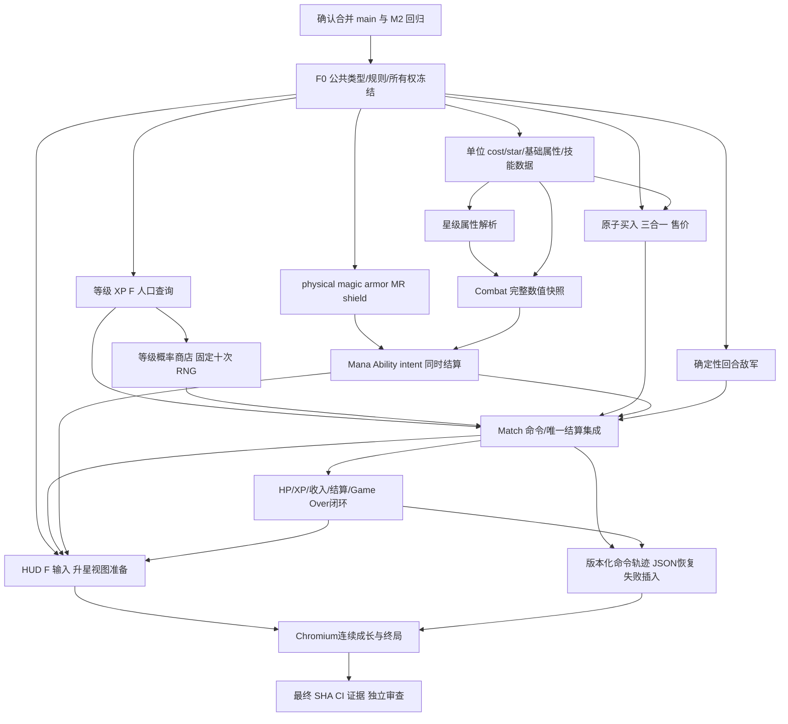

# M3：完整玩家成长循环实施计划

> 状态：Plan，尚未实施 M3。本文是一个完整里程碑的实施合同草案；内部波次用于控制依赖和并行写入，不拆成多个缩水的产品里程碑。
>
> 基线：`catfish-xn/cat`，最新远端 main `169f28e15e065aaa4c054dfcfd4739c7f110970b`，已合并 [PR #3：M2](https://github.com/catfish-xn/cat/pull/3)，其功能分支末提交为 `aa39a6fab441ab5626409aace267c593c3605cfc`。
>
> 检查日期：2026-10-04，Asia/Taipei。本轮只新增本文件，不改产品代码、测试、依赖和 CI，不提交、不推送、不创建 PR。以下新增 API、数值与文件是待实施设计，不应误读为仓库已有功能。

## 1. 完整目标与范围

M3 完成后，在同一页面、同一局游戏中，可以实际完成：

`D 搜牌 → 买第三张自动升星 → F 升级 → 多上人口 → 搜更高费单位 → 战斗中积累 Mana 并施法 → 胜负影响玩家 HP → 连续运营直到 Game Over 或继续游戏`。

本里程碑一次交付：

- 玩家等级、XP、自然经验、F 买经验、人口上限与等级商店概率。
- 1–5 费单位、小型可玩的内容集、三合一自动升星、二星/三星属性成长与一致的售价。
- Mana、数据驱动 Ability 框架、物理/魔法伤害、armor/MR、基础护盾。
- 玩家 HP、败局扣血、平局规则、唯一结算、Game Over、重开与持续运营。
- 清晰可见的成长和战斗反馈，保留 M2 已完成的 D/E 即时操作体验，并加入 F。
- 同种子/命令/逻辑 tick 的确定性重放，真实 Chromium 多回合成长和终局验收。

不实现 traits、items、augments、anomalies、完整 S13 数据、shared champion pool、8 人 PvP、复杂控制、暴击、吸血、正式美术；也不扩展联网、账户、存档 UI、赛季数据导入、复杂 AI 运营、利息/连胜连败经济。M3 数值是可玩的原型规则，不声称复刻某个 TFT 赛季。

只增加支撑闭环的确定性敌军成长表，不引入另一套 PvE 模式。全范围是最终验收条件：只有等级商店或只有施法都不算 M3 完成。

## 2. 实际仓库核对与验证边界

### 2.1 main 与 M2

第一次检查时 main 确实仍为 M1 `abd9245`，用户要求暂停以完成合并；收到“继续”后重新执行 `git ls-remote origin refs/heads/main refs/heads/feat/m2-match-loop`、`git fetch origin main` 与提交历史检查，确认 main 已更新为上面的 `169f28e`。本计划依据合并后的树，不依据旧工作树或最初的 M2 草案。

工作分支 `work` 的 HEAD 保留在 `abd9245`；为避免规划轮切换/改写产品工作树，使用 `git show origin/main:<path>` 检查全部 M2 文件，并将精确 main 快照导出到 `/tmp/cat-m3-baseline-169f28e` 运行验证。未来实施应从确认后的最新 main 创建工作分支，不能直接在这个旧 HEAD 上开始开发。

### 2.2 已有接口及真正需要的增量

| 文件 / 接口 | M2 已实现 | M3 接入点与保留约束 |
| --- | --- | --- |
| `src/simulation/match.ts` | `createMatch`、`buyUnit`、`sellUnit`、`rerollShop`、`deployMatchUnit`、`startMatchCombat`、`stepMatch`、`nextRound` | 保留这些入口与纯命令方式；新增 `buyXp`、Match 部署查询、成长和 HP 结算 |
| `match-types.ts` | readonly phase union、MatchBase、RoundResult；phase 为 preparation/combat/settlement | 增加版本、level/XP/playerHp、gameOver 和结算字段，不建立第二份游戏状态 |
| `match-rules.ts` | 初始金10、买3、卖2、D费用2、收入5、商店5格，固定三种目录 | 保留初始金/D/收入/商店尺寸；买卖改按费用与星级，增加集中规则表 |
| `shop.ts` | `generateShop(rngState,generation)`，每格抽一次，三种单位等概率 | 显式接收 level；先抽费用再抽单位，每店固定十个 RNG word |
| `rng.ts` | `lcg32-v1`，显式 uint32 state，seed0有效 | 原算法和无隐藏状态约束不变 |
| `units.ts` | definition 有 health/attack/armor；Unit 只有 ID/definition/team/location | 增加 cost/star/MR/Mana/Ability；armor 现有数值此前未生效 |
| `game.ts` | 7格 bench、5个初始玩家棋子、2个固定敌军；`validateDeployment`、`deployUnit`、`getPlayerDeploymentCount` | 保留几何/占用/敌我权限规则；人口约束放 Match，单位初始化补星级 |
| `combat.ts` | `createCombat(GameState)`、`stepCombat(CombatState)`、`validateCombatStart` | 保持入口；创建时冻结星级后的完整属性及技能值；不把战损写回 preparation |
| `combat-tick.ts` | 50ms tick、BFS、稳定 ID 排序、移动占位预留、普攻 intent、同时伤害/死亡 | 在同一 tick 骨架增加施法 intent 和伤害管线，保留寻路/占位/同时结算 |
| `rendering/match-session.ts` | 同步委派命令，仅持 MatchState 和 accumulator | 新增 `buyXp()`，处理 gameOver；继续由 advance 消费固定 tick |
| `rendering/BoardScene.ts` | 原生 keydown D/E、即时同步、按 Phaser 实际显示顺序卖出、按 ID 协调 token | 增加 F、成长 HUD、升星、蓝条/盾/技能/HP；修正仅创建/删除 token 的旧假设 |
| `tests/match-replay.test.ts` | 全中间状态和事件比对、失败插入不变、逐步 JSON 恢复 | 扩展所有成长字段、技能、败血和终局；保留旧验证强度 |
| `scripts/verify-m2-*.cjs` | 原速五回合、D/E 高频、真实鼠标/touch、只读 debug、trace/截图/账本 | 升级为 M3 完整成长及终局路径，production preview 也执行完整路径 |

### 2.3 基线证据与本轮未做事项

在精确 main 的临时快照上，`npm ci --cache /tmp/cat-m3-npm-cache`、`npm test`、`npm run build` 已通过：13 个测试文件、131 项测试。实际工具为 Node 24.19.0、npm 11.9.0；仓库 CI 仍使用 Node22。构建含 TypeScript 严格检查，已有 Phaser 大 bundle 提示仍存在。

真实 M2 Chromium 五回合、touch和D/E高频回归也已通过，具体证据见本文末尾。仓库原 preview 脚本只做 smoke，不能称其完成五回合；M2 浏览器主路径是胜局，不能作为 M3 败血/Game Over 的证据。M3 尚未编写或执行，本文中的 M3 测试全部是实施后的门槛。

## 3. 架构原则与不变量

1. **Match 是唯一运营权威。** 金币、XP、等级、HP、阵容、商店、RNG、ID、回合历史全在 MatchState；UI 不传价格、奖励、伤害、结果或“已结算”标记。
2. **命令原子提交。** 失败返回同一输入 state 引用，不扣钱、不改 XP、不发合成事件、不推进 RNG/generation/serial；成功状态是新对象。所有旧快照保持不变。
3. **Combat 是隔离快照。** preparation 只有持有单位与位置/星级，不保存残血、Mana、shield、target、cooldown。下一战由 `createCombat` 全新构造，不复活已卖/被合成消耗的 ID。
4. **不重写固定 tick。** 20 tick/s、最长1200 tick、BFS邻居顺序、ID code-point比较、移动 reservation、同 tick 伤害同时结算保留。动画、帧率、wall clock 不决定战斗规则。
5. **无隐式随机。** Combat、升星、升级和敌军模板不抽随机；只有初始商店、成功 D、成功 Continue 刷店推进现有 Match RNG。
6. **即时输入。** D/F/E 与 pointer 输入沿原生事件顺序同步提交；不 debounce、不等待帧队列/动画、不因效果播放锁商店。
7. **可序列化。** 正式状态只有 JSON 数据，不存函数、Set/Map、Phaser引用或模块计数器。临时计算可使用 Map，但提交前归一化。
8. **有意升级旧契约。** M3 改动抽店次数/价格/战斗数值/Match空阵容门槛，不能要求 M2 字面 golden 值不变；必须保留相同的原子性、隔离、确定性和交互保证。

## 4. 冻结的首版玩法规则

以下给出可直接实施的默认设计。F0先冻结类型、公式和初始数表，F1在完整模拟后确认行为；波次2/F2前允许主agent集中做一次必要内容平衡校准。任何已冻结规则/内容的改动必须更新rulesVersion/contentVersion及fixture，并重跑相关证据，不能悄悄改变验收假设。F2之后只修阻塞缺陷，数值改动也须走同样的证据失效/重验流程。

### 4.1 等级、XP、人口

| 项目 | M3 规则 |
| --- | --- |
| 初始玩家状态 | level3、XP0、HP100、gold10；沿用5个初始1星玩家棋子和7格 bench |
| 等级范围 | 1–9；正常开局3，保留低等级表供模型/测试，不在 UI 增加降级能力 |
| 升级需求（当前等级 → 下一级） | 1→2:2；2→3:2；3→4:6；4→5:10；5→6:20；6→7:36；7→8:56；8→9:80 |
| F 买经验 | 每次4G获得4XP；不足4G拒绝；一次命令可跨多个门槛，逐级扣 threshold，保留余量 |
| 自然经验 | 每次战斗首次结算 +2XP，与收入/败血同一个原子转换；Continue 不再发 XP |
| 满级 | level9、XP规范化为0；F返回 `max-level`，不扣钱；自然XP实际获得0；临近满级的一次合法F仍收费4G，超额XP丢弃 |
| 人口 | `deploymentCap = level`，仅统计 player 且在 board 的实体数量；一只二星/三星仍占1人口 |
| 商店与升级 | F/自然升级不改变当前五格、generation 或 RNG；下一次 D/Continue 才用新等级概率 |

`validateMatchDeployment(state,id,target)` 先做 phase/旧部署校验，再检查 bench→board 的人口增加；board→board不增人口，board→bench合法移出，敌军不占玩家人口。Match Start 也防御性检查超人口。预览与 release 使用同一个 Match 查询，不在 UI 复制上限判断。人口满时买入仍合法，只受最终 bench/合成约束。

### 4.2 商店、费用、经济

| 玩家等级 | 1费 | 2费 | 3费 | 4费 | 5费 |
| --- | ---: | ---: | ---: | ---: | ---: |
| 1 | 100 | 0 | 0 | 0 | 0 |
| 2 | 100 | 0 | 0 | 0 | 0 |
| 3 | 75 | 25 | 0 | 0 | 0 |
| 4 | 55 | 30 | 15 | 0 | 0 |
| 5 | 45 | 33 | 20 | 2 | 0 |
| 6 | 30 | 40 | 25 | 5 | 0 |
| 7 | 19 | 30 | 40 | 10 | 1 |
| 8 | 18 | 25 | 32 | 22 | 3 |
| 9 | 10 | 20 | 25 | 35 | 10 |

每行总和100。每格固定抽两次：第一个 uint32 用 `floor(word*100/2^32)` 落到累计半开概率区间；第二个用 `floor(word*catalogLength/2^32)` 选中该费用的稳定有序目录。五格固定十个 word，即使该 tier 只有一个单位也消费第二个。非空目录是数据校验前置条件，禁止“空 tier 重抽/回退”改变消费次数。允许重复卡与连续相同商店。

- 商店仍为5格、D仍2G、首次结算仍+5G，无利息/连胜机制。
- 买价等于 definition.cost（1–5）。买入总为1星，价格由 simulation 决定。
- 卖价 `cost × 3^(starLevel−1)`，即单卡原价/3张原价/9张原价；不复刻 TFT 售价折损，规则透明且合成买卖无套利。
- initial gold、买卖、D、F、结算逐笔独立入账，不允许 gold<0；不存在 UI 传入的售价。
- purchased槽位不补货；generation仅整店刷新时递增。F之后点击当前 generation 的牌仍有效；D之后旧 generation 必须拒绝。
- 不做共享卡池、卡牌耗尽、返池或重抽约束。

### 4.3 小型单位集与星级成长

保留 sentinel/ranger/mystic 三个现有 ID，均为1费；新增2–5费各2个占位定义，共11个。新 ID 固定为 `bulwark/archer`（2费）、`arcanist/duelist`（3费）、`warden/tempest`（4费）、`colossus/oracle`（5费）。名称、符号、色框沿当前 Phaser 绘制，不导入正式资源。

每个单位必须具备完整 cost、baseStats（health/attack/armor/magicResist）、attackRange、attackIntervalTicks、initialMana/maxMana、abilityId。现有射程和攻击间隔的 hardcode 移入 definition，几何/速度算法不变。

- starLevel 为1/2/3，HP/AD倍率分别100/180/324%，由单一 `getUnitStats` 使用整数 `floor(base * percent / 100)` 推导。
- armor/MR、射程、攻击间隔、maxMana默认不随星级放大；技能数值使用明确的三元素表，避免把全部属性统一倍乘。
- 可用初稿抵抗值：现有 armor40/15/10 保留，MR分别30/15/20；其余定义依定位给非负整数。各 tier 必须有可辨识的耐久/输出/技能提升。
- 全部11个单位都有实际可施放的技能。最低内容覆盖：sentinel护盾、ranger物理单体、mystic魔法单体；新增单位至少提供一个魔法范围技能。
- 以下初始内容表由A/B在F0交叉审查后由主agent冻结；用于开始实施和寻找可行操作轨迹，不声称已经验证平衡。全部initialMana=0、攻击间隔20tick，盾持续60tick。

| ID | 费用 | 基础HP / AD | armor / MR | 射程 | maxMana | Ability ID / 效果 | 技能1★ / 2★ / 3★数值 |
| --- | ---: | --- | --- | ---: | ---: | --- | --- |
| sentinel | 1 | 800 / 45 | 40 / 30 | 1 | 80 | sentinel-guard / selfShield | 220 / 400 / 720 |
| ranger | 1 | 500 / 70 | 15 / 15 | 3 | 60 | ranger-shot / physical单体 | 150 / 270 / 486 |
| mystic | 1 | 450 / 80 | 10 / 20 | 1 | 60 | mystic-bolt / magic单体 | 180 / 324 / 583 |
| bulwark | 2 | 1000 / 55 | 45 / 35 | 1 | 80 | bulwark-guard / selfShield | 300 / 540 / 972 |
| archer | 2 | 650 / 85 | 20 / 20 | 3 | 60 | archer-shot / physical单体 | 220 / 396 / 713 |
| arcanist | 3 | 750 / 85 | 25 / 30 | 3 | 80 | arcanist-burst / magic范围radius1 | 210 / 378 / 680 |
| duelist | 3 | 1100 / 100 | 35 / 30 | 1 | 60 | duelist-strike / physical单体 | 300 / 540 / 972 |
| warden | 4 | 1500 / 90 | 55 / 50 | 1 | 80 | warden-guard / selfShield | 500 / 900 / 1620 |
| tempest | 4 | 950 / 110 | 30 / 35 | 3 | 80 | tempest-burst / magic范围radius1 | 300 / 540 / 972 |
| colossus | 5 | 1800 / 125 | 65 / 60 | 1 | 90 | colossus-guard / selfShield | 750 / 1350 / 2430 |
| oracle | 5 | 1150 / 125 | 35 / 45 | 3 | 80 | oracle-burst / magic范围radius1 | 420 / 756 / 1361 |

每个Ability ID有独立数据项，底层只复用damage/selfShield解释器。三档技能数值直接读表，不再叠乘HP/AD星级倍率。

### 4.4 三合一必须是购买事务的一部分

1. 校验 phase、slot、expectedGeneration、available和金币；失败不进入任何分配/随机逻辑。
2. 建立纯临时购买候选，候选 ID 为当前 `unit-${nextUnitSerial}`，尚不占正式 bench 格，不把临时 `location:null` 泄漏到 Unit/MatchState。
3. 在 player 的 board+bench+候选中，对同 definition、同星级的三张做合成；1→2、2→3，处理到固定点。3星封顶，不把不同星级或敌军合在一起。
4. 候选组按稳定保留优先级排序：board在前（row、col、ID），bench其次（slot、ID），无位置候选最后。取前三张，第一张保留 ID/位置并升星，其他两张消耗；继续处理升星产生的下一组。不得依赖数组输入顺序、鼠标选择或对象插入顺序。
5. 未被合成的购买候选才放入最终第一个空 bench slot。检查最终阵容是否合法、无冲突且 bench≤7；满 bench但能合成应成功，满 bench且不能合成则全事务拒绝。
6. 成功一次性扣牌价、标记槽位 purchased、提交阵容、serial+1与有序升级事件。购买计划输出的units按code-point ID规范排序，使输入数组置换也得到相同完整结果；其他单位的位置不变。新购 ID即使立即被消耗仍算已分配，未来不复用；失败serial不推进。

板上优先使玩家站位尽量保留；若多个板上同名单位合并，人口会下降，应立即更新HUD并允许补位。事件明确 survivorId、consumedIds、definitionId、fromStar/toStar和保留位置；consumedIds不包含survivor。连锁先发1→2再发2→3；不保存另一套“星级进度”。准备快照中的player单位保持规范态，同定义同星不足三张（3星除外）；敌军模板不自动合成。

## 5. Combat：Mana、技能、护盾与伤害管线

### 5.1 能力模型与快照

Ability采用有限数据联合类型，不引入通用脚本引擎：

- `damage`：当前最近敌人，physical或magic；radius0单体，radius1以目标格为中心的六边形范围，仅伤敌军。
- `selfShield`：自身获得护盾，持续整数 tick。

`AbilityDefinition` 包含ID、kind、三档数值表及适用参数；`ResolvedAbility` 在 `createCombat` 根据星级变成单个整数值并复制进 CombatUnit。Combat不得在每 tick读取可变化的全局内容表。规则版本相同的JSON快照可以独立恢复。

CombatUnit增量：starLevel、armor、magicResist、mana、maxMana、shield、shieldExpiresAtTick、ability（解析后纯数据）。已有 hp/maxHp/attackDamage/range/interval/cooldowns/alive/targetId保留。开战 hp=maxHp、mana=initialMana、shield=0、expiry=null，冷却/target/tick按M2重置；bench仍排除。

### 5.2 精确 tick 顺序

| 顺序 | 行为与确定性规则 |
| --- | --- |
| 1 | tick+1；递减现有 cooldown；`tick >= shieldExpiresAtTick` 的旧盾清零，死亡单位不行动 |
| 2 | 沿M2共享位置快照计算最近敌人和BFS移动，按ID保留目的地；不改寻路、邻居顺序或阻挡规则 |
| 3 | 使用移动后的统一存活快照选行动。Mana已满且目标合法则优先cast；否则若普攻ready且目标在射程则attack。damage技能用attackRange；selfShield需要有活敌人，无额外射程。施法不要求普攻cooldown归零 |
| 4 | 全部 intent先提交；cast清Mana至0，设置普通攻击cooldown为attackInterval；同一单位本tick不能既cast又普攻。无合法施法目标不扣Mana，沿普通规则移动/尝试攻击 |
| 5 | 应用全部已提交selfShield，再解析全部damage packets；新盾可挡本tick的攻击/技能，不因攻击者ID先后失效 |
| 6 | 每packet按类型减伤，按目标聚合，先扣盾再扣HP；所有HP同步结算后统一死亡，保留同tick互杀及已提交技能 |
| 7 | 仅仍存活者获得本tick Mana：成功普攻intent +10；受击 `min(20, floor(actualHpLoss/10))`；取本tick实际总HP损失计算一次，不逐packet刷蓝。clamp到maxMana，新Mana仅供下一tick判断 |
| 8 | 死亡单位mana/盾/expiry/target/cooldowns清零；先判全灭，再判timeout，随后最多一个combatFinished |

同tick死去的施法者已经提交的技能仍生效；没有事件回调连锁、施法读条、弹道延时或控制效果。移动与cast可同tick发生，沿用M2移动与攻击可同tick的原则。受护盾全部吸收不提供受击Mana；伤害者普攻即使被盾全吸收仍获得攻击Mana。技能不额外提供攻击Mana。

### 5.3 Damage 与 shield 数学语义

`DamagePacket = {sourceId,targetId,damageType:'physical'|'magic',rawAmount,sourceKind:'attack'|'ability',abilityId?,effectIndex}`。

- 普攻全部physical；技能按自身类型。physical读取armor，magic读取magicResist。
- M3抵抗为非负整数；内容校验拒绝NaN/负数，无穿透/减抗/true damage。公式：raw=0则0，否则 `max(1, floor(raw*100/(100+resistance)))`。
- 逐packet减伤后聚合每个目标，避免先合并再取整导致不同结果。packet按targetId/sourceId/effectIndex稳定排序；范围目标按ID排序。
- `mitigated = physicalTotal + magicTotal`；`absorbed=min(shield,mitigated)`；`hpDamage=min(hpBefore,mitigated-absorbed)`；HP/盾均clamp至0。保留overkill在mitigated中，但不算受击Mana。
- 每目标每tick发一个damage事件：amount为减伤后、扣盾前总量，另含physicalAmount/magicAmount/absorbed/hpDamage/hp/shield。明确这是M3对M2 amount含义的契约升级，不让UI把amount误当实际HP损失。
- shield首版仅自身单一数值，不做多来源层。施盾 `shield=max(currentShield,grant)`，expiry=`tick+durationTicks`（默认60）；再次施放刷新时长、取较大剩余值，不加法叠盾。已过期的盾先清除再授予；被打空后expiry立即置null。例如tick1授予60tick盾，可挡tick1–60，tick61开始过期。

固定事件阶段：shield过期（ID）→movement（ID）→attack/cast意图（来源ID）→shield授予（ID）→damage（目标ID）→manaChanged（ID，记录本tick最终值及分项）→death（ID）→combatFinished。施法消耗通过cast事件可见；对仍存活且Mana有消耗或获取的单位发最终manaChanged。事件只是已经提交状态的说明，不执行规则。

护盾规范态满足 `shield===0 ⇒ shieldExpiresAtTick===null`。shieldChanged仅用于授予/续期或真实过期，数值或期限有变化才发事件，不发0→0空过期事件；伤害吸收/破盾由damage的absorbed/shield字段说明，不再重复发一份shieldChanged。

## 6. 回合、玩家 HP、敌军与终局

### 6.1 唯一结算

沿用 `match.ts` 私有 `withCombat` 作为唯一结算入口，同时写入：

- 本轮结果与combatTicks；收入+5G。
- 自然XP（非满级时+2，按升级函数归一化）；记录level/XP前后值和实际经验。
- `roundBaseDamage = 2 + 2 * floor((round-1)/3)`。
- playerWin：扣血0；enemyWin：`roundBaseDamage + 2*存活敌军数量`；draw：扣roundBaseDamage（双灭和timeout一致，无存活加成）。
- `playerHpAfter=max(0,playerHpBefore-playerDamage)`。无治疗，不给胜利加HP；记录原始playerDamage和实际hpLost，二者在致死溢出时可能不同。
- 写入唯一RoundResult；HP>0进入settlement，HP=0直接gameOver并保留FinishedCombat/最后结果，不先可交互地经过settlement。

致死局仍原子发放约定收入/XP并记录，随后全部运营命令锁定；最终金币/等级可用于复盘，不能继续花费。UI没有claim/reward/settle按钮。stepMatch在settlement/gameOver返回原state和空events；重复Start/Continue/帧更新不得重结算。

### 6.2 Continue、空阵容与重开

- Continue只在settlement且expectedRound吻合时成功：round+1、combat=null、刷新敌军、使用已结算后的当前level刷新商店。不给第二份钱/XP、不改玩家HP、不改玩家阵容/站位/星级。
- Game Over不能Continue/Start/D/F/E/买/部署。公开New Match按钮调用原有Session.newMatch，使用相同seed重建整局；不要把终局恢复成带奖励的旧回合。
- 空玩家棋盘出战是合法弃守：Match忽略低层 `missing-player` 阻挡，但仍拒missing-enemy/missing-both；UI明确显示“空阵容出战：立即战败”。复用 `createCombat` 单边tick0终局与withCombat结算，无新救济命令。
- 这能覆盖“卖光单位且D/F花光金币”后的恢复/终结路径，代价是明确败血；不能无限无损刷钱。低层 `validateCombatStart` 保持原来的诊断能力，Match策略单独解释它。
- tick0终局没有step产生的combatFinished事件，UI必须依据phase/result同步显示，不能把结算显示绑在事件上。

### 6.3 最小确定性敌军成长

新增 `createRoundEnemies(round): readonly Unit[]`，只生成enemy，不调用RNG；主 agent拥有此表及集成。初始回合仍是当前两个敌人；从第二回合开始按表推进，保证成长阵容有对手和败局压力。

初始模板如下；`name×星级`中的乘号表示该实体星级，不是数量，每个列表项都是一个单位。

| 回合 | 敌军列表（按槽位顺序） |
| --- | --- |
| 1–2 | sentinel×1、ranger×1 |
| 3–4 | sentinel×1、bulwark×1、ranger×1 |
| 5–6 | sentinel×2、bulwark×1、archer×1、arcanist×1 |
| 7–9 | sentinel×2、bulwark×2、ranger×2、arcanist×2、warden×2 |
| 10+ 模板A | bulwark×2、duelist×2、archer×2、arcanist×2、warden×2、oracle×2 |
| 10+ 模板B | bulwark×2、duelist×2、archer×2、arcanist×2、tempest×2、colossus×2 |
| 10+ 模板C | bulwark×2、duelist×2、archer×2、arcanist×2、warden×2、colossus×2 |

round10+按 `(round−10)%3` 取A/B/C。前两轮沿用原位置 `(2,1)/(4,2)`；其余模板前两个槽位仍用这两格，后续依次用 `(0,1)/(6,1)/(2,0)/(4,0)`。固定位置合法且不重叠，不增大棋盘或做敌方经济；敌方技能使用相同Combat框架。

初始敌军可保留enemy-1/enemy-2，后续生成用 `enemy-r${round}-${slot+1}` 的确定性ID，与玩家unit-N命名空间分离，不推进nextUnitSerial。这样更换模板不会因复用ID留下旧definition的token图形；C仍须按当前definition/star同步视图。Continue只替换enemy，绝不重建玩家Unit。

玩家在round10+仍可继续，没有强制胜利结束；败血基础项随回合提升，避免终局验证需要无上限等待。最终表必须经过纯模拟和真实试玩校准：普通运营能持续多轮，弱阵容能在有限回合Game Over，首8轮足以看见升星/升级/施法。只调表，不根据玩家当前阵容自适应作弊。

## 7. 依赖图与关键路径



真正关键路径是：F0 → 属性/合成/等级商店与Combat效果两条并行路径 → Match唯一结算 → UI接通 → 可负担的真实操作脚本 → 最终验收。UI骨架和独立测试可以提前并行；最终演示不能用mock接口替代真实Match。HP公式本身不必等待技能完成，但最终存活数/胜负和快照重置必须在真实技能管线上验证。

## 8. 公共接口与冻结点

### 8.1 F0：并行实现前冻结

主 agent在 `docs/MATCH_CONTRACT.md`、`docs/COMBAT_CONTRACT.md` 升级至M3契约，新增 `docs/M3_RULES.md` 放集中数值/时序表；保留历史M1/M2计划和验证文档。F0必须是完整接口骨架与类型检查可通过的一个集成点，不能让四个agent各自猜测字段。

```ts
// 示例是待实现的公开合同，不是已有代码。
type CostTier = 1 | 2 | 3 | 4 | 5;
type StarLevel = 1 | 2 | 3;

// Unit 新增必需 starLevel；Definition 新增 cost/MR/Mana/ability/攻速射程。
// getUnitStats 返回解析后的 readonly 战斗属性，禁止重复实现倍率。
getUnitStats(definitionId: string, starLevel: StarLevel): ResolvedUnitStats;
getUnitSellPrice(unit: Unit): number;
getDeploymentCap(state: MatchState): number;
getXpToNextLevel(level: number): number | null;
getShopOdds(level: number): readonly [number, number, number, number, number];

validateMatchDeployment(state: MatchState, id: string,
  target: UnitLocation): MatchFailure | undefined;
buyXp(state: MatchState): MatchCommandResult;

// 原有命令名/参数保留；UI只能从match.ts公开入口调用Match。
buyUnit(state: MatchState, slot: number, expectedGeneration: number): MatchCommandResult;
generateShop(rngState: number, generation: number, level: number): {
  readonly shop: Shop; readonly rngState: number;
};

// 内部纯helper：A实现，主agent的Match调用，UI不直接调用。
grantXp(level: number, xp: number, amount: number): ProgressionResult;
planPurchase(preparation: GameState, definitionId: string,
  candidateId: string): PurchasePlanResult;

interface ProgressionResult {
  readonly level: number;
  readonly xp: number;
  readonly xpRequested: number;
  readonly xpApplied: number;
  readonly levelsGained: number;
}
type PurchasePlanResult =
  | { readonly ok: true; readonly preparation: GameState;
      readonly events: readonly UnitUpgradedEvent[] }
  | { readonly ok: false; readonly reason: 'bench-full' };

// 原有Combat边界不变。
createCombat(preparation: GameState): CombatState;
stepCombat(state: CombatState): CombatStep;
```

冻结的类型增量：

| 类型 | 新字段 / 约定 |
| --- | --- |
| MatchBase | `schemaVersion:3`、`rulesVersion:'m3-v1'`、`contentVersion:'m3-content-v1'`、level、xp、playerHp；deploymentCap派生，不冗余保存 |
| MatchState | 增加 `phase:'gameOver'; combat:FinishedCombat` 分支；零HP只能出现在gameOver |
| MatchFailure | 增加`max-level`、`population-cap`；其余M2原因保留；判断顺序phase→参数/陈旧状态→资源→最终容量 |
| MatchCommandResult | 成功分支新增 `events: readonly MatchEvent[]`；失败分支保持state/reason且无事件。未合成的成功命令events为空 |
| MatchEvent | 首版仅`unitUpgraded`及上一节的survivor/consumed/star/location字段；XP/HP由快照及RoundResult读取，不建事件总线 |
| MatchStep | 保持 `{state, events: readonly CombatEvent[]}`；Match命令事件与Combat tick事件明确分开 |
| RoundResult | 原round/result/combatTicks/income/goldBefore/goldAfter保留；加xpAwarded、levelBefore/After、xpBefore/After、hpBefore/After、baseDamage、survivingEnemyCount、playerDamage、hpLost |
| CombatUnit | 星级、双抗、Mana、shield/expiry、ResolvedAbility；数值字段全部有限整数 |
| CombatEvent | 新cast、shieldChanged、manaChanged；damage扩展分项，不改movement/death/finished时序保证 |
| MatchSession | 新`buyXp()`；commit原样返回包含升级事件的结果；advance的返回仍为CombatEvent[]；newMatch重置所有字段/accumulator |

`xpAwarded` 表示真正进入经验进度的数量，满级为0，临近封顶时不计被丢弃的溢出；F日志同时记录固定请求4XP和实际变化。`planPurchase` 成功返回完整新preparation和升级事件，失败不提供部分结果。shop目录/技能表缺失是开发期配置错误，应被启动数据校验/测试拒绝，不做随机fallback。

内容校验至少包括：HP>0、AD/双抗/伤害/盾为非负有限整数、maxMana>0、0≤initialMana≤maxMana、attackIntervalTicks≥1、attackRange≥1、shield durationTicks≥1；三档技能值齐全、ID唯一、全部引用存在、费用1–5且每tier目录非空。A/B各验证自己持有的数据，主agent负责跨表校验集成。

新增事件字段在F0一并冻结，B/C/D使用同一份类型：

- `cast`：tick、sourceId、abilityId、targetIds（稳定排序，自盾为自身ID）、manaSpent；damage类型/范围来自CombatUnit的ResolvedAbility，不由UI推导目标。
- `shieldChanged`：tick、unitId、reason（`granted`或`expired`）、before、after、expiresAtTick（可null）；续盾归granted。
- `manaChanged`：tick、unitId、before、spent、attackGain、damageGain、overflow、after。gain为clamp前的规则值，`after=before-spent+attackGain+damageGain-overflow`；仅存活单位发，死亡清零由death/终态快照说明。
- `UnitUpgradedEvent`：`type:'unitUpgraded'`、survivorId、consumedIds（按ID排序）、definitionId、fromStar、toStar、location；事件location也是不可变副本。

F命令失败优先级固定 `wrong-phase → max-level → insufficient-gold`；因此满级且没钱也报max-level。其他命令保留其独立校验顺序，不把所有失败随意折叠成“操作失败”。

F0同步迁移所有Unit初始化/fixture至必需starLevel，或统一test factory；不要长期使用 `starLevel ?? 1` 掩盖缺字段。不承诺加载M2未版本化的历史JSON；replay遇到schema/rules不匹配明确拒绝，不“尽量恢复”。

### 8.2 F1：第一次模拟集成后冻结行为

冻结合成ID/位置和事件顺序、XP归一化、概率边界/十次draw、施法与盾同tick规则、HP公式/终态、敌军模板、失败优先级。纯模拟全链路通过后，D生成版本化真实操作fixture，C接实接口。任何后续修改通过主 agent统一更新合同、实现、oracle和fixture。

### 8.3 F2：最终验收前冻结UI观察合同

冻结稳定button names、HUD字段、read-only debugSnapshot、输入优先级、证据JSON结构。`window.__CAT_DEBUG__.read()`只能深拷贝：真实state、真实已渲染星标/HP/Mana/shield信息、bounds、selection/drag/effects。禁止setter、dispatch、加钱、改商店、加速时钟或注入胜负。

## 9. 主 agent + 最多4个 subagents 的所有权

整阶段最多同时5个agent（主agent+4个subagents）；不再由子agent扩编。所有权按文件划分，一时一主。共同工作区或独立worktree均可，但主agent串行集成。任何改公共接口的请求先交主agent，其他人不能自行写共享文件。

| Owner | 独占写入文件（未来实施） | 责任 / 禁止越界 |
| --- | --- | --- |
| 主 agent | `src/simulation/match.ts`、`match-types.ts`、`match-rules.ts`、`unit-types.ts`（新）、`combat-types.ts`、`ability-types.ts`（新）、`game.ts`、`round-enemies.ts`（新）；`tests/match-contract.test.ts`、`tests/deployment.test.ts`、`tests/combat-start.test.ts`、`tests/match-helpers.ts`；公共合同/README/M3计划；`package.json`、lockfile、CI | F0、Match集成、HP/GameOver、敌军、公共类型、文档、最终审查与验收；不在A/B/C/D活跃写入时改他们的文件 |
| A：成长经济与数据 | `units.ts`（定义/重导出types）、`unit-stats.ts`、`progression.ts`、`upgrades.ts`、`shop.ts`；`tests/progression.test.ts`、`tests/upgrades.test.ts`、`tests/unit-stats.test.ts`、`tests/shop.test.ts`、`tests/rng.test.ts`、`tests/simulation.test.ts` | 纯成长/合成helper、目录/费用/基础属性、固定抽店；不修改match.ts或combat运行时，rng.ts保持不动 |
| B：战斗扩展 | `combat.ts`、`combat-tick.ts`、`combat-damage.ts`（新）、`combat-abilities.ts`（新）；`tests/combat-contract.test.ts`、`tests/combat-simulation.test.ts`、新增damage/ability/mana测试 | 快照、双抗/盾/Mana/技能、同时结算；实现冻结的类型，不自行加新随机源或Match结算 |
| C：呈现与交互 | `rendering/BoardScene.ts`、`rendering/match-session.ts`、`src/style.css`（如需）、`tests/match-session.test.ts` | F与HUD、升星token更新、蓝/盾/施法、GameOver、同步输入与清理；不写simulation规则、browser oracle |
| D：独立测试与浏览器证据 | `tests/match-economy.test.ts`、`tests/match-lifecycle.test.ts`、`tests/match-replay.test.ts`、新增integration测试；`scripts/verify-m3-browser.cjs`、`verify-m3-desktop.cjs`、旧browser兼容入口、`tests/fixtures/m3/*`、`docs/M3_VALIDATION.md` | 独立账本/重放/真实输入脚本、证据审查；发现产品缺陷交回owner，不边审查边改产品来隐藏失败 |

F0期间只有主agent写公共文件；A/B/C/D先读代码/提出接口意见。F0需要的跨文件机械迁移由各owner执行，主agent串行汇合。`board.ts`、`hex-layout.ts`、`rng.ts`原则上不改；若发现与M3直接相关的真实缺陷，主agent先明确临时唯一owner和测试，不能顺便重构。

数据交叉依赖采用明确分工：A拥有UnitDefinition中的abilityId/费用/基础属性；B拥有abilityId对应效果表。主agent在F0冻结ID清单、技能schema，在F1运行交叉引用/费用目录非空校验。D不从生产helper复制同一个答案作为独立oracle。

完成某文件后要提交所有权交接说明：变更、测试、未决点、已停止写入。最后波次D以只读审查为主；需改脚本时先声明，主agent不同时编辑。

## 10. 实施波次与集成门槛

### 波次0：基线与F0合同（主agent串行，四名subagent只读评审）

- 从最新main创建实施分支，确认包含M2合并及两次D/E修复；复跑基线，记录SHA。
- 主agent冻结第4–8节类型、规则、事件、数据清单、所有权；准备纯helper签名和类型迁移方案。
- A审升级/合成/概率；B审tick/盾/Mana；C审UI数据需求；D审可独立验证性及有限步浏览器方案。
- 出口：F0文档完整、无互相矛盾的字段/数值/事件，类型骨架可编译、M2不变量有明确迁移列表。

### 波次1：成长与战斗两条主干并行，UI/QA同步准备

- A：XP归一化、费用目录、属性成长、原子合成计划、level商店、纯单测。
- B：Combat快照、逐packet双抗/盾管线、Mana、四种实际效果组合（物理/魔法单体、魔法范围、自盾），沿旧tick骨架完成单测。
- C：成长HUD/F输入/按ID更新星标，基于F0接口开发；不把mock规则留入正式路径。
- D：独立概率/经济/合成oracle、replay日志schema、针对旧价格/固定ID断言的迁移清单、浏览器输入计划。
- 主agent：依次接A的helper实现Match命令、人口query与空阵容门槛；实现HP/XP/收入唯一结算和敌军表。B模块就绪后接通Combat，不让A/B同时改match.ts。
- 出口F1：纯simulation已能完整 `买→合成→F→部署→更高费刷新→施法→败血→Continue/GameOver`；无占位throw、无双重结算，相关单测/类型检查通过。

### 波次2：整局闭环与交互集成

- C接真实Match/Combat事件，完成升星、mana/shield、结算与终局展示；解决保留ID升星、被消耗drag/selection、gameOver即时HUD。
- D跑跨系统经济/序列化/重放，锁定可用真实预算完成的seed+行动fixture；不依赖临时加钱。A/B根据测试和有限数值预算修复原owner文件。
- 主agent检查所有旧M2原子性/鼠标/touch/生命周期回归已迁移，确认普通与空阵容都可继续运营或终结；数值只在这时集中校准并冻结。
- 出口F2：一局可手动完成完整体验；read-only观察合同稳定；每种功能已有可定位的验收步骤；build和全部simulation/session测试通过。

### 波次3：真实Chromium、最终审查和交付

- D运行dev和production preview的完整成长/终局及高频D/F/E；主agent看截图/trace并逐项核对账本，C处理显示/操作问题，A/B处理规则问题。
- 所有修复回到原owner并重新集成；只重跑受影响测试，最终候选SHA统一跑完整release门槛。
- 主agent串行完成最终源代码diff/范围检查、文档、CI配置、最终SHA证据；D独立复核证据是否确实覆盖成长、败局、GameOver、同事件即时提交。
- 出口：第14节所有必过项完成，无用下一“小里程碑”代替本M3必需功能的遗留项。交付按实施任务授权进行；本规划轮不发布代码或建立PR。

## 11. UI与高频D/F/E验收规范

### 11.1 必须可见的成长反馈

HUD显示Round、Gold、玩家HP、level、XP/next threshold、已部署/人口上限；满级明确显示MAX。商店每格显示名字、费用、费用色框；提供当前等级概率说明。F按钮显示4G/+4XP，与键盘同路由；卖出显示所指/所选单位当前售价。单位星标是持久信息，合成提示可以短暂，但不能只闪一下而无法确认二星。

战斗显示HP、Mana、剩余shield、施法标识/简易连线/范围，足以看出“积蓝→满蓝→消耗→技能效果”。不要仅把Mana写进debug但不画出来。结果显示胜负、金币收入、经验变化、HP前后/扣血原因；Game Over显示最终回合、HP0和New Match。

保持960×800基准与现有等比缩放；把HUD布局调整纳入检查，不能把F按钮挤在不可点击的板格上。390×844用Chromium touch验证购买/F按钮/精确拖拽/Continue。无需正式美术或多设备全面适配。

### 11.2 输入语义

- F加入M2原生keydown处理，与D/E同样每次实际事件即时commit，处理OS repeat；忽略Ctrl/Meta/Alt、IME与editable input。
- E目标仍为拖拽ID→当前几何且Phaser显示顺序的hover→显式selection；hover敌军必须阻止错误回落。成功出售清旧selection，晚到mouse-up不能复活被卖单位。
- 沿用M2成功命令取消当前drag/旧短暂effects的策略；失败命令不改变正式状态、不破坏仍有效的drag。D/F成功后需重新开始拖拽，规则与UI提示一致。
- 合成后对survivor更新既有token的星标/属性；consumed IDs对应token/graphics/tween/map引用全部删除。被消耗selection/drag清空，不把选择偷偷转到另一单位。
- 合成提示在commit/reconcile之后产生；紧接D/F/E可清掉短暂动画，但持久星标/状态正确。显示回调不发命令、不扣钱、不延迟下一输入。

### 11.3 必过高频矩阵

| 类别 | 真实输入与断言 |
| --- | --- |
| 完整快速链 | 无人工动作间隔地执行 `D→买第三张→F→拖上新增人口→D→买更高费→hover E→D`，逐事件金币/XP/人口/星级/RNG/视图一致；重复至少3组可负担的D/F/E混合链 |
| 按住与连按 | D、F各测无keyup多次keydown（确认isTrusted/repeat）和多次独立press；每个成功事件一次提交，无“每帧最多一次”丢失 |
| 穷尽资源 | 成功到金币不足后继续至少30次D/F拒绝；完整state/RNG/serial/generation不变；满级F的30次拒绝在纯模拟+独立初始化浏览器边界fixture覆盖 |
| 事件顺序 | D/F交错逐笔账本；F不刷新当前店，F后D用新概率；D后旧generation买入拒绝；同次keydown观察器已能读到新状态 |
| 合成容量 | 满bench不合成拒绝；满bench第三张成功；板上/bench survivor、连锁三星、合成后立即E、D、F及晚到mouse-up，无ghost token和重复扣钱 |
| E精确目标 | 不同旧selection、enemy hover、空白selection fallback、重复E、相邻hitbox重叠、旧token拖到前景后与点击选中一致 |
| 拖拽中快捷键 | D/F/E成功、失败、取消drag及晚到release；升级后重新拖可增加人口；人口满预览与正式拒绝一致；落点必须是pointer释放的准确hex |
| 锁阶段 | combat/settlement/gameOver的D/F/E、买入/部署/Start均由Match拒绝；gameOver的Continue拒绝；不能仅按钮变灰但快捷键仍生效 |
| 生命周期 | scene shutdown移除原生监听；重开/场景重建不重复处理一键；modifier、IME、input/textarea/select/contenteditable不触发游戏命令 |

浏览器动作使用Playwright真实mouse/keyboard/touch，不用DOM `dispatchEvent(new KeyboardEvent(...))` 伪造通过。没有人为sleep的快速链可以有read-only状态断言，但不能在每步加100ms等待来掩盖延迟；真实战斗与必要视觉采样可以正常等待。

极端三星/满级 fixture可在独立测试上下文开局前构造，必须标记为边界fixture并与生产路径分离，绝不能用于满足主成长链/终局的真实运营证据。优先用纯模拟穷尽边界，浏览器证明交互集成；生产debug始终只读。

## 12. 测试与deterministic replay

### 12.1 有意义的测试矩阵

| 层 | 必须覆盖的边界 |
| --- | --- |
| XP/人口 | 阈值前/等于/超过、连续升级、溢出、封顶、满级F、资金不足、自然XP只一次；board→board不吃人口、bench→board超限、合成释放人口、Start防御校验 |
| 商店/RNG | 各level累计概率边界、零概率tier不出现、每层目录非空、两词每格/十词每店、稳定目录顺序、seed0/最大uint32、同seed同序列、失败不消耗；保留独立BigInt LCG oracle |
| 买卖合成 | 2+1升2、8+1连锁3、3星封顶、不同definition/star/team不合成、board+bench合并、满bench能/不能合成、stable survivor/位置、输入数组排列不改结果、消耗ID永不回归、卖价守恒 |
| 属性/快照 | 1/2/3星整数推导、2星血量/攻击实际影响战斗、能力数值表随星级、armor/MR不误用；准备/战斗深隔离、bench排除、每轮Mana/HP/盾/cooldown重建 |
| Damage | 物理只读armor、魔法只读MR；0/高抗/最小1/多packet取整；护盾全吸收/部分/破盾/过期当tick/续盾；overkill不多返Mana；状态/事件分项相符 |
| Mana/Ability | 初始Mana、攻击+10、受伤返蓝每tick一次且封顶、满蓝下一tick施法、无目标不耗蓝、cast优先且无同tick普攻、AOE固定目标集合/次序、致死不返蓝、同tick互杀与技能仍生效 |
| Match结算 | win/loss/draw/timeout/tick0空阵容；收入/XP/HP/history一次性；致死clamp/gameOver；重复step/Start/Continue无奖励；Continue恢复阵容、生成敌军且不多给XP |
| UI Session | 总时长不同delta分割得到完全相同state/events、非法delta、终态清accumulator、即刻D/F/E混合命令、newMatch清空成长/历史/时钟、输入重建不双监听 |
| 长程 | 至少10轮纯模拟运营；另一路弱阵容完整GameOver；在可行seed下完成所有费用tier/三星路径；无阵容/没钱仍能有代价继续，不软锁 |

保留M1棋盘/寻路/占位/互杀/终态no-op测试；因armor和技能导致旧damage/tick golden变化时，使用明确的新期望或0抗/足够高maxMana（测试期限内不会施法）的隔离fixture测原不变量，不能以maxMana=0绕开契约或删测试降低要求。M2固定3G/2G、固定三目录和“每买必增一个token”的断言必须迁移为新独立账本，不能改成只断言命令ok。

### 12.2 版本化重放合同

```text
Replay header: schemaVersion=3, rulesVersion=m3-v1, seed, contentVersion,
               initialStateDigest, sourceSha
Ordered records: seq, round, logicalTick, command + arguments,
                 accepted/reason, commandEvents, stateDigest
Tick records: step count / tick ordinal, ordered CombatEvents, stateDigest
```

重放命令覆盖buy(slot,generation)、sell(id)、deploy(id,完整board或bench target)、reroll、buyXp、start、continue(expectedRound)。保留直接函数入口；重放dispatch可在测试/工具层统一，不为M3引入另一套产品命令架构。newMatch是新轨迹边界，不能偷偷重置半份状态。

验收要求：

1. 同规则版本/seed/命令总序/逻辑tick重复执行，比较每个完整state、命令返回事件和Combat事件，包含最终RNG、ID、HP和gameOver；digest用于定位分歧，不代替深相等。
2. 在每一类阶段逐步JSON stringify/parse恢复，包括满蓝准备施法、盾生效/即将过期、连锁合成后、结算和gameOver；没有外部“已经扣过血”标记。
3. 插入非法slot、陈旧generation/round、已购买槽、已合并/已卖ID、没钱D/F、满级F、人口满、wrong-phase及重复Continue：成功轨迹和RNG不变，额外失败日志除外。
4. Combat输入单位数组排列不得改变输出state/events；合成选择使用明确排序，不能因array顺序改变保留位置。
5. `MatchSession.advance` 用相同总时长的不同delta分割（整数毫秒、0、长帧及12.5/37.5等可精确表示的小数）得到同结果与事件序列，达到终态后余量清零。不对任意十进制浮点累加在tick临界点做不成立的bit级等价承诺；0.1ms等浮点边界另测有限余量/实际消费tick，不把其微小舍入差当作规则随机性。确定性重放始终以记录的逻辑tick为权威。若日后加每帧cap必须保留backlog，不能丢tick。
6. 同时创建另一Match不影响当前RNG/IDs。升级/合成/施法/HP结算不推进shop RNG。
7. 独立oracle固定概率表、BigInt LCG、经济守恒与XP/HP整数算术；集成测试可用生产API执行，但oracle不能再调用同一被测helper生成答案。
8. M2与M3抽店算法消费次数不同，必须按version区分；不宣称旧M2 seed轨迹逐字兼容，不静默载入旧日志。

## 13. 真实Chromium多回合验收与证据

### 13.1 两条生产规则路径

主成长/终局路径均固定现有页面的默认seed42；先在纯simulation中寻找并锁定该seed下有限操作数、真实预算可行的输入表，固定费用目录/敌军表后再运行浏览器。不新增生产seed选择器或调试setter；seed0/其他seed的覆盖留在纯模拟或明确独立的启动fixture。若默认42下找不到合格路径，必须在F1/F2前解决内容/预算问题并重新冻结证据，不能只挑一个页面无法启动的幸运seed。浏览器可以读取只读状态决定点击/等待，但不能写live state。初始资源只来自 `createMatch`，后续只来自购买/出售/自然收入/经验。

**路径A：连续成长并继续游戏。** 同一page、同一match，至少结算8轮并Continue进入第9轮准备，全程不reload/New Match，不用多次独立开局拼接：

- 实际D找牌、买第三张二星，看到消耗ID删除与survivor星标/成长属性；不能仅在启动fixture里预置二星。
- 实际F跨至少一个等级门槛，补上原本人口上限外的单位，准确部署到指定hex。
- 在至少一次升级前后证明概率变化：获取一个原等级概率为0而新等级可出的更高费单位（例如3级→4级后3费），随后上场。
- 战斗中自然积蓝、施法和消耗Mana；至少观察damage能力与selfShield，物理/魔法均有真实效果、护盾确实吸收伤害。
- 至少一场真实playerWin和一场非空阵容enemyWin；核对HP账本和每轮唯一结果。不能用修改maxTicks/HP/敌军的脚本强制结果。
- 每次Continue检查玩家ID/星级/站位保留，出售/合成ID不回归；下次Start检查新鲜HP/Mana/shield/target/cooldown/tick与bench排除。
- 高频混合链嵌入同一局自然资源预算；高费/技能可在后续回合实现，但不得以作弊补资源完成必过点。

**路径B：真实终局。** 另开一局，以真实弱阵容连续出战直到HP0、Game Over（预期20轮内；F1锁定实际有界回合数）：

- 至少一次非空弱阵容真实败局；空阵容tick0败局可另验证软锁恢复，但不能代替全部真实战斗。
- 每败检查存活敌数、roundBase、playerDamage、hpLost/HPclamp、收入/XP/history各一次；最后直接gameOver。
- GameOver后空等并发送D/F/E、购买/部署/Start/Continue，状态不变、RNG/奖励不变。
- New Match恢复初始seed、gold/HP/XP/level/1星阵容/serial/shop/round和无Combat/旧tween；不会复用死局奖励。

Production preview执行这两条关键路径和D/F/E核心回归，不再只是买牌smoke；不能依赖dev专用 `/src/simulation/*.ts` URL。预期fixture由离线模拟/独立oracle生成，正常构建页面按真实输入运行。不得调整50ms tick、加速时钟、通过调试API瞬间结束战斗。

### 13.2 视觉与交互断言

除比较MatchState，必须核对真实rendered星级文字、HP/Mana/shield条和数值、F按钮、费用/售价、人口上限、结算扣血与GameOver。debugSnapshot当前只收集顶层Text且health只有visible，M3应增加token内部可见信息的只读观测；不能从state捏造一份“已渲染值”。保存升星、升级补人口、首个施法/盾、败局、终局截图。

保留M2移动端touch/精确释放hex、enemy权限、占用、hover排序与输入监听清理回归。console.error和pageerror必须为空，不能过滤真实错误；每次Continue/重开清理旧效果与拖拽，允许短暂当前动画，但不得残留历史单位/蓝盾条。

### 13.3 命令、CI与证据格式

未来实施完成后执行：

```sh
npm ci
npm test
npm run build
npx playwright install --with-deps chromium
npm run test:browser
npm run test:preview
```

主agent把现有package scripts迁到M3脚本；旧M1/M2入口可做明确wrapper，历史验证文档保持原样。系统浏览器可用 `CHROMIUM_PATH=/usr/bin/chromium`；CI优先锁定Playwright配套Chromium，报告实际版本。

延续两类CI职责；若dev+preview两条长路径超过现有15分钟预算，将browser job做dev/preview矩阵，每job预算20分钟，保持单战75秒上限与原速tick。原速路径受浏览器负载影响超时须保存证据并诊断，不用加速掩盖。

每个suite无论成功失败保存 `artifacts/m3-*/`：sourceSha、git dirty/untracked说明、schema/rules/contentVersion、seed、浏览器/Node版本、输入序列与trusted/repeat、每步账本、逐轮gold/level/XP/HP/RNG、结果、截图、Playwright trace、console/pageerror/server日志。CI `if: always()`上传，最终文档链接对应workflow和artifact。

最终候选实现必须测试**同一个SHA**。临时脏树调试通过可用于修复，不能冒充最终release证据；代码/数值变更后重跑受影响路径，最后在clean implementation SHA上完成完整门槛。仅补证据文档的后续提交要明确区分文档SHA与最后产品SHA，CI仍验证交付提交。

## 14. 完成定义、风险与收口

M3完成需要全部满足：

- 本文第一节完整成长链在生产规则/真实Chromium中可玩；两条路径及preview验收通过。
- 所有指定系统已接真实Match/Combat状态，没有假按钮、placeholder能力或只在测试中存在的成长。
- 原子经济/合成、人口预览一致性、十次RNG、版本化重放、JSON恢复、唯一HP/XP结算和GameOver锁定均有独立测试。
- 131项基线覆盖所保护的几何、隔离、确定性、D/E即时操作全部保留或明确迁移；不能靠减少测试达到绿灯。
- 无新增excluded系统，无重写Match/Combat/RNG架构，无正式素材依赖。
- 高频D/F/E无人工延迟遮掩、无余额负数/重复扣款/旧generation购买/ghost单位/被合成ID复活。
- 最终源码SHA的test/build、Chromium dev/preview、CI通过；主agent与D完成独立证据审查，`docs/M3_VALIDATION.md`可复现。

| 风险 | 收口方式 |
| --- | --- |
| 多人同时改公共类型或BoardScene | F0先冻类型，单一文件owner，集成串行，跨owner只提接口请求 |
| 满bench合成/连锁导致部分扣款或丢单位 | 纯planPurchase→验证最终状态→一次提交；测试card-equivalent与gold守恒、所有历史快照冻结 |
| 二星属性有显示无战斗效果 | 统一getUnitStats、Combat数值快照，实际battle和已渲染值双断言 |
| 盾/技能打破同时伤害或产生顺序优势 | 全intent先生成，同tick盾统一授予，逐packet减伤后统一扣HP，数组排列/互杀测试 |
| 新事件使UI延迟或double settle | UI只渲染，Match唯一withCombat，原生同步D/F/E，phase/result驱动tick0与gameOver |
| 新高费/技能/成长使原固定敌军失去意义 | 最小固定回合模板、F1有限模拟校准、真实8轮成长与弱阵容终局双门槛 |
| 极端运营软锁 | 合法空阵容出战按现有tick0终局扣HP/给收入，明确可继续/可终结，不增加救济系统 |
| 硬编码M2 oracle被删后“绿灯” | D独立重写新表/账本，保留同等边界覆盖，最终审查比对旧测试意图 |
| 真实脚本依赖幸运刷牌/无限等待 | 冻结版本化seed+有界操作表、真实预算核算；数据变化重新找fixture，不作弊补钱 |

本M3结束后才另行讨论羁绊、装备等后续里程碑。本阶段可以留下数值平衡和视觉精修空间，但不能把Mana/Ability/HP/升级/合成中的任何一项当作后续可选补丁。

## 15. 本轮检查记录

- 已核实远端main与M2合并关系，读取M2全部公共Match/Combat/RNG接口、UI与关键测试/脚本/CI。
- 使用主agent加4个只读审查/验证subagents：成长经济、Combat扩展、UI/验收、基线验证；未让subagent修改产品文件。
- 精确main临时快照：依赖安装、13 suites / 131 tests、TypeScript与Vite build通过。
- 原M2 `test:browser`通过（退出0、passed=true、dirty=false、errors为空），系统Chromium `151.0.7922.173`、Playwright `1.63.0`。同局5轮均playerWin，tick为126/141/141/141/141，金币6→11→16→21→26→31，继续至round6/generation7；另通过390×844触摸、3轮桌面高频链（64个记录步骤）和reset/缺敌边界。
- 原M2 `test:preview`通过（退出0、dirty=false、errors为空），仅首屏/购买/D/E smoke。没有声称M2 preview跑了五回合，也没有声称本轮核验了远端CI、其他浏览器或实体触摸设备。
- 临时基线证据：[dev结果JSON](/tmp/cat-m3-baseline-169f28e/artifacts/m2-browser/results.json)、[preview结果JSON](/tmp/cat-m3-baseline-169f28e/artifacts/m2-preview/results.json)，各目录保有截图与trace。这些是当前环境的本轮验证产物，不是未来M3 release证据。
- 本轮M3产物仅 `M3_PLAN.md`。本文件是实施计划，不能作为M3已完成或M3测试已通过的证明。
