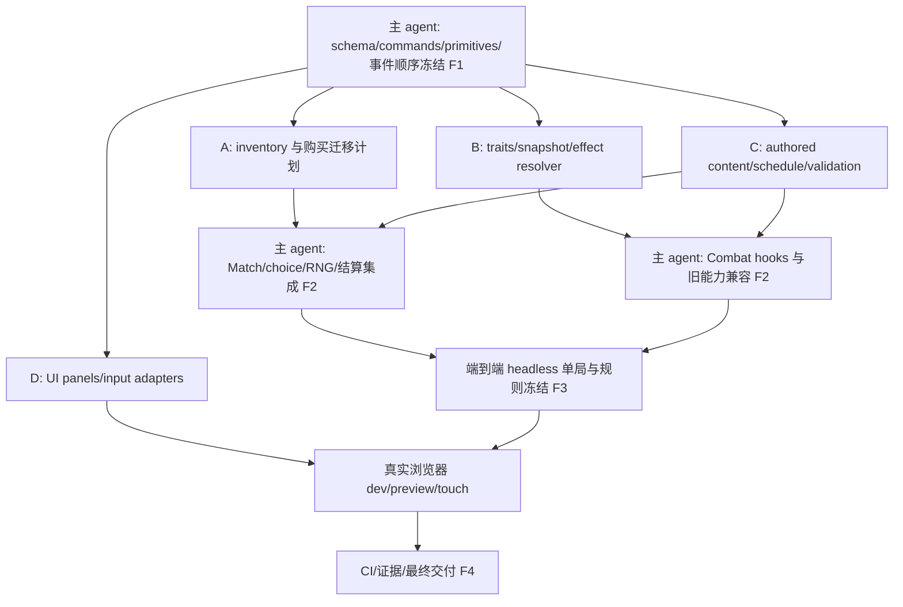

# M4 PLAN — 完整策略构筑层 + S13 风格垂直切片

状态：按后续明确授权的 `/goal` 实施。原规划范围和门禁保留；规则以 [RULES](M4_RULES.md) 为唯一详细来源，验收以 [ACCEPTANCE](M4_ACCEPTANCE.md) 为清单，实际执行结果单独记录于 [M4_VALIDATION](docs/M4_VALIDATION.md)。

## P1. 基线与实际仓库审查

2026-10-04 通过 GitHub branches/main 确认 main 为 `133a41b4ef4257bee1b4bd458103393177fdf93e`，合并 PR #4（完整 M3）。只读源码审查固定在该 SHA；不是只读旧 M3 计划推测实现。环境 git clone 的代理连接失败，使用 GitHub 连接器读取源码；本地是审查副本，不冒充 git checkout。原规划阶段没有执行或声称通过产品测试；后续实施已建立真实 git checkout，基线与最终门禁见 M4_VALIDATION。

| 已有事实 / 审查入口 | M4 决策与约束 |
| --- | --- |
| `src/simulation/match.ts`：纯命令，失败返回原引用；`withCombat` 唯一结算，`nextRound` 唯一 Continue；空阵可正常认输 | 扩展该事务边界；奖励不能在 UI 或重复 Continue 中发放 |
| `match-types.ts` schema3；四阶段；单个 `rngState`；普通状态全为 JSON | schema4 增加 choice、持久装备/选择状态和显式 RNG streams；保留旧 shop stream 初始算法，明确版本不兼容 |
| `upgrades.ts`：购买候选不占格、递归三合一、最后检查 bench、固定 survivor 身份规则 | 装备与绑定迁移纳入同一个 purchase plan，不改变 survivor 排序 |
| `combat.ts` 从 GameState 复制 board-only；`combat-tick.ts` 顺序明确；`combat-abilities.ts` 已有 11 个技能定义 | Match 先编译独立战斗构筑输入；用有限 hooks 接入，保留已有意图/同时伤害/Mana 语义 |
| `units.ts` 11 单位；`unit-stats.ts` HP/AD 星级缩放；`validate-content.ts` 已检查单位/技能引用 | 扩展到 18 单位，保留旧单位数值和技能；内容适配以 declarative records 为主 |
| `match-rules.ts` D=2G、F=4G/4XP、开局 level3/100HP/10G；`round-enemies.ts` 根据绝对 round 选模板 | 保留经济基本规则与 round 权威；只新增 schedule 与派生 stage label |
| `BoardScene.ts` 约 36KB，集中 UI/input/动画/debug；`match-session.ts` 独立 50ms accumulator | 拆出新 panel 与统一输入路由，原棋盘/战斗动画留在 Scene；不换框架、不重构 BFS |
| `scripts/verify-m3-browser.cjs` 先跑 growth，再另开 terminal，再另跑 touch；debug 为只读 | M4 需要新增单局全链路径，不能沿用分段结果充当完整验收 |
| `.github/workflows/ci.yml` 已有 Node22、Vitest/build、Chromium dev/preview matrix + artifacts | 保留并扩充现有门禁，不降为截图冒烟检查 |

仓库递归树未发现 AGENTS.md。辅助只读审查分为 simulation 和 UI/acceptance 两项；三份文档与规则裁决由主 agent 统一。

## P2. 完成定义与范围

玩家在一个正常新 Match 内能完成 D 搜牌/升星、F 升人口、部署凑羁绊、正常获得组件、合成并装备、Augment 三选一、中期选单位/付费 reroll Anomaly/绑定、继续作战和运营直到 Game Over/New Match。四类来源必须与旧 Mana/Ability 同时影响真实 Combat，并能从状态与事件追溯来源。

必须成套交付的纵向能力：

1. Trait 去重计数、阈值激活、准备预览、战斗冻结。
2. 组件与成装实例账本、配方、最多三槽、出售返还、升星保留与溢出返还。
3. 共用 modifier/effect primitives、确定性 hooks、snapshot provenance。
4. 三选一 Augment、永久 Match modifiers；Anomaly 单位绑定及 reroll。
5. 幂等 schedule、阻塞 choice、确定性普通奖励及获取 UI。
6. 有实际组队路径的 18 单位/6 traits/5 组件+15 成装/8 augments/8 anomalies。
7. 版本化 JSON restore/replay、原子失败、输入并发边界及单局 dev/preview 验收。

这是比 M3 更大的完整里程碑。各波次是内部可集成切片，不得将“只有数据表”“只在 fixture 可见装备”“Anomaly UI 未入战斗”宣称 M4 完成。

不做：全量 S13 数据、shared pool、carousel、8-player/network、对手经济 AI、Riot assets、复杂 replay/save UI、完整 loot orb 表现、3D。原创试验规则不声称复刻正式 S13。

## P3. 受控 schedule 演进

决定本轮做数据驱动 round schedule，但不替换原 Match/Combat/RNG 架构。`round` 仍是从 1 开始的唯一回合索引，history、敌人模板、伤害公式仍基于它。`stage=1+floor((round-1)/3)`、`stageRound=1+(round-1)%3` 仅派生显示，绝不另存可漂移计数。这是试验切片的三战一阶段，不是正式 S13 时点表。

R2/R5 两次 Augment；R7（显示 3-1）Anomaly；R7/R8 能证明绑定后两次完整战斗。自动奖励、选人、reroll 和确认的精确顺序见 [RULES R2–R6](M4_RULES.md#r2-回合与特殊事件时序)。未来 M5 可换 schedule 数据、显示映射及 content pack，不重写回合循环。M4 不加入 PvE/PvP 类型切换或另一个时钟。

## P4. 模块边界与依赖图

新增模块建议：`strategy-types.ts`、`effects.ts`、`trait-snapshot.ts`、`strategy-snapshot.ts`、`inventory.ts`、`choices.ts`、`round-schedule.ts`、`rewards.ts`、`serialization.ts`、`content/{traits,items,augments,anomalies}.ts`。职责边界比确切文件数更重要；若模块只是两行转发可合并，但不得把具体内容 ID 判断放入 tick 主循环。

纯 simulation 不导入 Phaser/DOM/wall clock。Match 保存持久构筑，Combat 保存一次冻结输入与运行时计数器；renderer 只展示和发命令。无任何 UI “修复状态”、动画回调发奖励或隐含 RNG。

## P5. 实施 ownership：主 agent + 最多 4 subagents

以下分工已用于本轮实施。每个文件同时只有一个 owner。共享工作区以主 agent 的 ownership ledger 为准；需要他人核心文件变更时提交接口请求/补丁说明，由 owner 落地。不得并行改同文件后靠解决冲突集成。

| Owner | 独占文件 / 工作 | 不拥有的关键边界 |
| --- | --- | --- |
| 主 agent | `match*.ts`、`unit-types.ts`、`combat-types.ts`、`ability-types.ts`、`combat.ts`、`combat-tick.ts`、`combat-damage.ts`、`combat-abilities.ts`、`strategy-types.ts`、`choices.ts`、`serialization.ts`、`rng.ts`、`shop.ts`、`unit-stats.ts`；`tests/fixtures/m4/oracle.*`、`match-replay.test.ts`、`match-session.test.ts`；CI/package/scripts 最终集成 | 全部公共类型、RNG方案、事件顺序、transaction接线、验收总路径由主 agent 签收 |
| A inventory | 新 `inventory.ts`、现 `upgrades.ts`、inventory/upgrade 专属 tests | 只返回 plan；不得写 Match 类型/入口，不能自行改 survivor 规则 |
| B effects | 新 `effects.ts`、`trait-snapshot.ts`、`strategy-snapshot.ts`、对应 tests | 依据冻结类型输出 intents/snapshot；不改 Combat 主循环 |
| C content | 新 `content/*.ts`、`round-schedule.ts`、`rewards.ts`、现 `units.ts`/`validate-content.ts`/`round-enemies.ts`、对应 tests | 只写数据和纯 planner；shop catalog 需主 agent 更新 `match-rules.ts` |
| D rendering | `BoardScene.ts`、`match-session.ts`、新增 `rendering/{strategy-panel,item-panel,choice-overlay,input-router}.ts`、新增独立UI adapter tests（不含既有match-session.test.ts） | 调用已冻结命令，不能改 simulation；浏览器脚本归主 agent避免多人改共享oracle |

W2 四个 subagent 可真正并行：A处理资源事务、B处理纯战斗构筑、C填充已冻结schema内容、D构建只消费DTO/命令的UI。尚未接线时的 adapter测试不能被报告为浏览器验收完成。若主 agent 改公共协议，先广播版本差异、暂停受影响支流并统一升级，不默默兼容两套语义。

## P6. 波次、冻结点与退出条件

| 波次 | 交付 | 退出条件 / 冻结点 |
| --- | --- | --- |
| W0 基线 | 跑已有 unit/build/Chromium，记录SHA；固定M3规则oracle；审查本计划 | 基线失败先解释/修复，不把已有故障归给新系统 |
| W1 contracts | schema4、命令failure/guards、ItemId/choiceId、有限primitive、排序/舍入/RNG表、schedule | F1：主 agent 冻结公共类型与规则；先具备零modifier旧Combat兼容测试 |
| W2 并行 | A/B/C/D各自产物及专属测试 | A原子迁移、B确定性resolver、C全内容验证、D命令映射可独立审查 |
| W3 合流 | 主 agent接线Match/Combat/choice；全部普通奖励可到达 | F2：headless从createMatch一路通过所有系统；不允许debug注入才能推进 |
| W4 可玩与调参 | 精确单局recipe、18单位内容路径、R7/R8绑定持续性、实战可视provenance | F3：规则/内容版本、验收seed与行动账本冻结；修改数值必须重跑受影响golden及完整路径 |
| W5 验收 | 完整dev/preview、touch、高频、JSON/replay、CI、证据索引 | F4：ACCEPTANCE全部门禁；未过任何必需能力不交付“完整M4” |

F1前解决结构语义；F3前可依平衡证据调数值，不可临时删除系统或改成fixture。内容数量可在用户给出的目标范围内小幅调整，但必须保留每个primitive及所有构筑链路的代表覆盖，三文档同时更新数量/表/断言。

## P7. UI 拆分范围

已有 BoardScene 保留棋盘布局、token/Mana/Ability动画、场景生命周期与组合调用。新增 strategy panel 展示当前/下一trait tier和来源；item panel管理分页库存、配方与三槽；choice overlay管理modal与Anomaly选人/确认；input-router集中native D/F/E与gesture上下文。MatchSession仅同步转发新命令与管理accumulator。

实施裁决：保留 Phaser 棋盘，新策略面板使用原生 DOM/CSS（无第二 UI 框架、全局 store 或 event bus）。实际触摸验收需要可滚动内容、可读文字和至少 44px 控件；原生面板降低缩放与坐标复杂度，仍只读取 Match DTO、提交同一命令，不承担任何游戏规则。面板集中在 strategy-panel.ts，手势在 input-router.ts，未为每个标签拆出空壳文件。面板不要各自保存一份Match；派生显示可缓存但提交必须重新验证。战斗面板显示冻结trait tier，准备面板显示当前部署；不能混用。小屏采用可切换面板和大触摸目标，不把文字缩到无法阅读。输入优先级及取消语义见 RULES R10。

## P8. 风险与交付策略

| 风险 | 控制 / 需要的证据 |
| --- | --- |
| Hook无限递归、顺序依赖、同tick死者触发歧义 | 有限hook/单层derived intents、稳定排序、合法hook-action白名单、互杀/置换测试 |
| 装备在递归升星丢失或重复 | 全局Item实例单一归属、purchase plan整体迁移、守恒断言和失败原引用 |
| Anomaly绑定随consumedId消失 | 绑定转survivor；出售永久消失且不重开事件；JSON/两战验证 |
| choice有钱才能结束、空阵无单位 | 免费确认、固定reroll成本、空owned roster时公开的保底招募规则 |
| D刷商店改变Anomaly候选 | 独立显式RNG stream；只按表中成功操作消耗 |
| 内容多而无法实际取得/打到中期 | 奖励开局即有组件、早期trait低费路线、W4固定正常单局recipe；对手曲线独立审查 |
| 新UI拖拽阻塞高频D/F/E | 所有键同步按事件顺序提交；取消手势不取消经济命令；choice权威阻塞 |
| 用生产实现生成oracle掩盖同源错误 | 手算microcase + 冻结state/event hash + 真实单局日志，不能仅调用同一个resolver比较自己 |
| 计划变成无限通用技能框架 | 本轮只有已列primitive；新内容若需要新能力须走schema/测试评审，M5再扩充 |

未来实施建议内部按 contracts → systems → playable slice → acceptance 分组提交，最后以完整 M4 交付（可一个集成feature PR或按依赖审查；不得把中间PR等同里程碑完成）。最终需更新 MATCH/COMBAT contract、版本变更说明、M4验证证据索引；PR说明只描述最终行为和实际通过项。

原计划阶段已结束。后续用户明确授权完整 M4 实施、修复及 GitHub CI；当前交付按 F4 门禁签收，不能以原计划的停止条件中止已授权工作。

## P9. 实施 ownership 交接记录

公共类型、事务入口、Combat hooks、restore、最终脚本/CI 始终由主 agent 控制。A 完成 inventory/upgrades 后接收经济/session 与长成长测试迁移；B 完成 effects/snapshot 后只新增序列化与多 seed 审查测试；C 完成内容后只做核心与 UI 审查；D 完成 rendering 后独占 verify-m4-interactions.cjs。最终集成脚本由主 agent 独占。任何时刻最多四名 subagents，没有两个 owner 同时修改核心文件。
