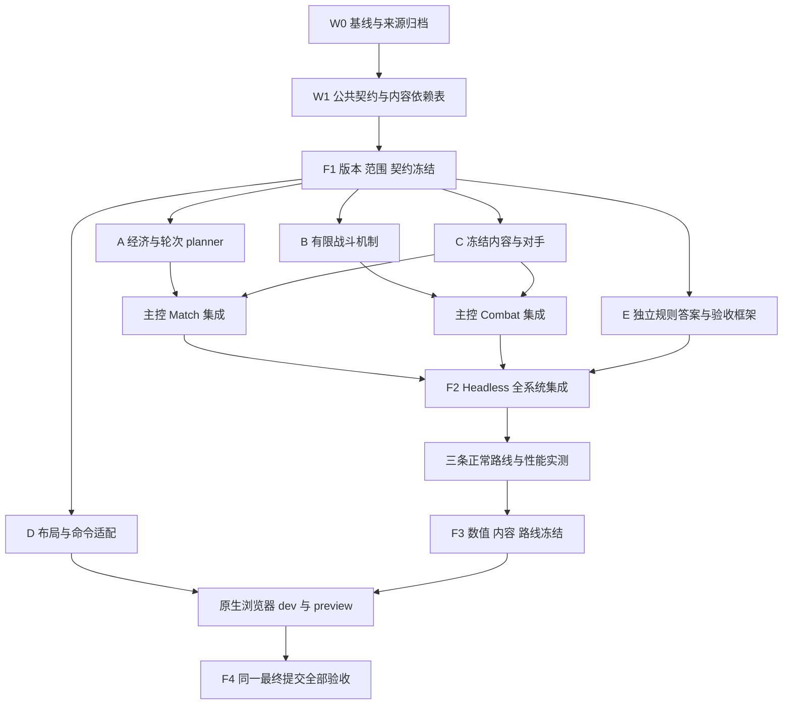

# M5 PLAN — S13 14.24b 单人运营与代表性构筑

状态：已获用户实施授权，M5 产品实施进行中。详细规则以 [M5_RULES](M5_RULES.md) 为准，验收以 [M5_ACCEPTANCE](M5_ACCEPTANCE.md) 为准。未来实施结果须单独记录，不能把计划验收写成已经通过。

用户确认的还原边界：**保留核心机制与历史数值，允许明确记录的弹道几何、单人对局及部分副羁绊简化。**

## P1. 已确认的真实基线

2026-10-05 规划审查记录：

| 项目 | 核验结果 |
|---|---|
| 实际仓库 | `/root/projects/hex-autobattler` |
| Remote | `https://github.com/catfish-xn/cat.git` |
| Branch | `main` |
| 本地 HEAD、远端 main | `5a4ce80394bde766e79d57a31d8625e5a0b381c3` |
| M4 已审查提交 | `9eb5e081350ea00a1963f3799529a9f8b83da078` |
| 合并关系 | HEAD 为 PR #5 合并提交，包含上述 M4 提交 |
| 文件树差异 | HEAD 与已审查 M4 提交之间无文件差异 |
| 工作区 | 规划审查前后均干净；本次保存新增三份 M5 规划文档 |
| 仓库指令 | 未发现适用的 `AGENTS.md` |
| PR 状态 | [PR #5 已合并](https://github.com/catfish-xn/cat/pull/5)；规划期间未执行合并 |

已阅读 README、M4_PLAN、M4_RULES、M4_ACCEPTANCE、docs/M4_VALIDATION、Match/Combat 契约、相关实现、测试及 CI。M4 当前是原创 S13 风格切片，不能仅修改显示名称就宣称实现了历史 S13。

实施时从重新核验的实际 main 建立 M5 分支。如果 main 再次前进，先审查新增差异，保留本计划所依赖的全部 M4 修复；不得退回 M3。保护已有未提交工作，不自动合并 PR。

证据分三类记录：

- **已有证据**：M4 已审查提交的 [PR CI 成功记录](https://github.com/catfish-xn/cat/actions/runs/37255849737)，以及 PR 中记录的 dev 846.752s、preview 849.802s 完整浏览器结果。这些不是规划审查期间重新执行的结果。
- **规划审查实际检查**：568/568 测试通过，36 个测试文件，总耗时 42.44s；TypeScript 与生产构建通过，Vite 构建阶段 8.87s。首次测试、构建被只读沙箱阻止，获准后重跑成功。
- **未来门禁**：本计划中的 M5 测试、正常路线、浏览器与性能验收均尚未执行。规划期间没有重跑完整 M4 浏览器流程。

检查机器为 Linux x64、4 个逻辑 CPU、8GiB 内存、Node 24.21.0；现有 CI 使用 Node 22。构建仍有大于 500kB 的 chunk 提示，不能将“构建成功”解释为加载性能已经达标。

## P2. 玩家体验与范围裁决

M5 完成后，玩家可以从正常新局进行存钱吃利息、经营连胜败、锁店、搜牌、升级、选择补给和三次强化，在 4-6 为核心绑定异常，逐渐完成三套代表性构筑之一，最终挑战 6-7 终局并重新开局。

### 必须完成

| 编号 | 数量与范围 | 完成定义 |
|---|---|---|
| M01 | 35 个轮次，2-1 至 6-7 | 模板对战、补给、PvE 各有明确语义；支持胜利和失败终局 |
| M02 | 一套运营经济 | 基础收入、胜利金、利息、连胜败、经验、掉血、锁店及独立账本 |
| M03 | 19 个可购买英雄 | 使用冻结历史数据；对应技能真实进入 Combat，包含正常获取路径 |
| M04 | 5 个职业羁绊 | 实现当前内容可达到的档位，准备预览与战斗冻结一致 |
| M05 | 3 套八人口构筑 | 正常购买、升星、奖励、装备及转型后持续实战至终局 |
| M06 | 7 种组件、9 件成装 | 全部具有配方、普通奖励来源、装备效果与守恒验收 |
| M07 | 6 个强化、每局选 3 次 | 2-1、3-2、4-2，所有选项均能进入实际战斗或经济结算 |
| M08 | 3 个异常 | 4-6 选目标、单项展示、1G 刷新、绑定和至少两场持续实战 |
| M09 | 有限战斗扩展 | 系数、暴击、多目标、持续施法、治疗、分层盾、状态、分担、永久成长 |
| M10 | 运营及战斗反馈 | 可见目标、实扣伤害、吸收、治疗、状态、来源及结算明细 |
| M11 | schema5、回放和兼容策略 | 完整状态/事件确定性；旧档明确拒绝；内容与规则漂移可检测 |
| M12 | 原生输入与性能门禁 | Chromium 桌面、触屏电脑、手机竖横屏；保留全部 M4 缺陷回归 |

“19 个英雄完成”必须同时包含数据、能力、商店、显示及验收，不能只加入定义记录。各能力的测试映射见 [ACCEPTANCE A1](M5_ACCEPTANCE.md#a1-必做能力与验收映射)。

### 候选

1. **Safari 正式支持**：须增加 WebKit 引擎验证和 iPhone/iPad Safari 真机输入证据后单独签收。
2. **单人有限单位池**：有改善搜牌约束的价值，但当前只有 19 个英雄，直接套原版池规模仍不能还原完整概率环境；本轮先固定并公开无限池简化。
3. **自由存档/回放界面**：本轮提供稳定序列化和验证接口，不扩展完整管理界面。

候选不进入 M5 完成条件，不得在实施中未经更新三份文档就转为隐含必做。

### 明确暂缓

全量 S13、八人联网、完整对手经济 AI、共享选秀、6 费英雄、10 级、四星、召唤与复活体系、海克斯英雄改造、开局奇遇、转职、神器/光明装备、复杂 3D。

副羁绊只在资料页标注原生身份及“本版本未开放”，不显示虚假的激活效果。包含 Academy、Enforcer、Emissary、Conqueror、Rebel、Experiment、Firelight、Family、Scrap、Automata、Visionary。

裁决理由：先使有限内容形成正常可玩的运营和战斗闭环；副羁绊、共享经济及召唤等会引入新的生命周期和奖励系统，不作为本轮默认扩展。

## P3. 架构与公共边界

继续使用 TypeScript＋Vite＋Phaser：

- Match 是金币、经验、血量、轮次、持久成长、装备及奖励的唯一权威。
- Combat 只接收冻结 snapshot，固定 50ms tick；不读取运行中的 Match 或动态内容目录。
- UI 读取状态、事件和纯 selector，提交同步原子命令，不计算另一套收入、伤害或奖励。
- 所有随机状态、延迟动作、计数器、护盾和状态均可 JSON 表达。
- 不引入任意脚本技能、表达式解释器、递归事件总线。

| 边界 | 公共接口必要变化 |
|---|---|
| Match | `roundDefinitionId`、`streak`、`outcome`、`shop.locked`、持久成长账本、强化累计值、战斗种子流 |
| RoundResult | 轮次类型、收入分项、利息基数、连胜败前后值、XP requested/applied、伤害及唯一结算 ID |
| Choice | `augment / anomaly / component`，以及完成后返回 preparation 或 settlement 的明确位置 |
| Command | `setShopLock`、组件选择；既有选择命令支持新 choice；价格和奖励不得来自 UI |
| Ability | 有限动作和目标选择；AD/AP/最大生命系数；延迟动作与持续施法记录 |
| Combat | 冻结基础属性、运行状态、独立盾层、待执行动作、暴击 RNG、成长增量 |
| Event | 目标、逐包伤害、治疗、盾层变化、状态变化、成长获得、收入和商店刷新 |
| Serialization | schema5 校验；动态属性由基础值和状态重新推导；拒绝不一致派生字段 |

公共类型由主控统一落地。新增字段必须同时更新命令 guard、restore、事件、observer、独立测试和文档，不允许只让 TypeScript 编译通过。补给 settlement 可以没有 Combat，必须解除现有“每个已结算轮次都有 finished Combat”的隐含约束。

排序、舍入、随机数消耗、来源和版本策略见 [RULES R4](M5_RULES.md#r4-商店选择与随机数)、[R6](M5_RULES.md#r6-有限战斗机制及语义)、[R7](M5_RULES.md#r7-对手界面及版本)。

## P4. 六角色 ownership 与接口流程

五个规划子代理 A—E 均已实际启动并提交报告，主控完成统一裁决。规划会话仅允许四个代理同时运行，实际分批执行，没有递归创建代理。角色数量不代表六条独立实现线。

| Owner | 独占责任与文件范围 |
|---|---|
| 主控 | 公共 `*-types.ts`、`match.ts`、`combat.ts` 入口、snapshot 接线、`serialization.ts`、RNG 接口、`main.ts`、package/CI、契约和三份 M5 文档 |
| A 经济 | `match-rules.ts`、`shop.ts`、`progression.ts`；新增纯经济/轮次推进 planner；对应局部测试 |
| B 战斗 | `combat-tick.ts`、`combat-abilities.ts`、`combat-damage.ts`、`combat-effects.ts`、`effects.ts`；状态/延迟动作 resolver；对应局部测试 |
| C 内容 | 版本化 units、abilities、traits、items、augments、anomalies、schedule、rewards、enemy 数据及验证器 |
| D 界面 | `rendering/`、样式、输入路由、反馈组件；MatchSession 委托适配也归 D |
| E 验收 | M5 独立 oracle、fixtures、正常路线、浏览器/证据/比较脚本、回放及性能验收测试 |

实施前由主控把技能定义从当前技能执行文件分离给 C；分离完成后 B、C 才能并行编辑。`upgrades.ts` 的成长合并由主控接线，A/C 提交规则需求，避免多人改共享文件。

一个文件同一时间只有一个 owner。接口变更流程固定为：

1. 提交字段、语义、兼容及测试影响。
2. 主控裁决并更新公共契约版本。
3. 广播给受影响角色，暂停旧接口接线。
4. owner 修改共享文件，各角色升级消费者。
5. 集成检查通过后恢复并行工作。

主控交叉审查已纠正 A 初稿的升级经验、九级商店及掉血表；按 C 的英雄需求补齐 B 初稿未覆盖的永久成长、多段施法和分担；采用 E 对独立 oracle、预算和 Safari 证据边界的要求。最终内容数量以本文及 RULES 为准，不沿用子报告中的候选数量。

## P5. 实施波次与冻结点

| 波次 | 工作 | 退出条件 |
|---|---|---|
| W0 | 重新核验 main、运行基线、保存资料和版本覆盖清单 | 真实 SHA、工作区、基线结果和来源可追溯 |
| W1 / F1 | 冻结全部规则、数据导入映射、动作类型、排序、随机数和 ownership | 参考版本、范围及公共契约冻结 |
| W2 | A/B/C 并行；D 做稳定 DTO 下的界面；E 写独立数学答案 | 独立模块和局部测试可审查；若环境仍限制四并发，先 A/B/C，再 D/E |
| W3 / F2 | 主控接线，正常命令贯通轮次类型、内容与成长回写 | Headless 全系统集成；无需注入资源才能推进 |
| W4 / F3 | 三路线、敌方曲线、数值、版本、golden 和实测预算冻结 | 正常获取、成型、持续作战和终局可重复 |
| W5 / F4 | 最终干净提交通过全部自动检查、完整浏览器矩阵及证据一致性 | 同一最终 SHA 完成全部必需门禁 |

F3 调参只允许修改公开单人对手内容及有依据的错误修正；不得通过赠资源、隐藏提高出卡率或削掉核心机制修通验收路线。

## P6. 实施前条件与风险

实施前不再有 M4 合并依赖；需要重新确认 main、归档固定数据与覆盖清单，并通过 F1。三份规划文档的保存不代表 F1—F4 已经执行。

| 风险 | 控制与验收 |
|---|---|
| 19 个英雄被误当成纯数据扩充 | 逐技能机制映射；永久成长、分担、多段施法不得删成单次伤害 |
| 精选无限池偏离原版搜牌环境 | UI/规则明确声明；固定费用概率及普通获取路径，禁止隐藏出卡特例 |
| 历史资料不完整或混入不同模式 | 固定 hash、标准模式 API ID、热修复覆盖表、简化项与置信边界 |
| 动态状态破坏 restore 的静态相等校验 | 基础与运行态分离；逐 tick restore；来源、计时和派生属性核验 |
| 分担/治疗形成递归或同 tick 顺序错误 | 有限阶段屏障、非递归派生包、独立手算和完整事件断言 |
| 35 轮增加浏览器/CI 时间 | 路线分 job、正常时间实测、F3 冻结预算，不加速 tick |
| 新界面重现触摸重复与穿透 | 保留原生输入永久回归，完整状态比较 |
| Safari 被 Chromium 模拟结果误覆盖 | 未取得 WebKit 和真机证据前不承诺支持 |

可并行的是经济纯模块、有限战斗机制、冻结内容、界面布局与独立验收框架；公共契约必须先冻结，正常路线必须等 headless 集成，浏览器完整门禁必须等内容与路线冻结。最终由主控逐项签收，不能以五份分报告拼接代替集成验收。

当前进度：F1 公共规则、F2 headless 集成和 F3 内容/路线/实测预算已完成；F4 等待预算冻结后的最终提交通过全部门禁。实际证据记录于 [docs/M5_VALIDATION](docs/M5_VALIDATION.md)。

本轮用户审计重新打开M5：ba5c057的测试与CI证据保留原归属，但六项缺陷使M5尚未验收。实施按Fix→Review→Final Gate推进；修复与复审记录见docs/M5_FIX_REVIEW.md。PR保持草稿，不合并main，不启动M6。
